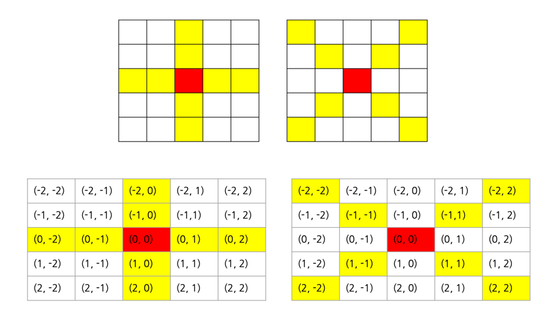

# 요구사항 분석
파리 킬러 스프레이를 한 번만 뿌려 최대한 많은 파리를 잡으려고 한다.\
스프레이의 노즐이 + 형태로 되어있어, 스프레이는 + 혹은 x 형태로 분사된다.\
스프레이를 M의 세기로 분사하면 노즐의 중심이 향한 칸부터 각 방향으로 M칸의 파리를 잡을 수 있다.\
뿌려진 일부가 영역을 벗어나도 상관없다.

## 입력
```
T: 테스트 케이스의 수
N: 배열 사이즈
M: 스프레이 세기
arr: N*N 사이즈
```
## 출력(목표)
m 세기로 스프레이를 분사해서 한 번에 잡을 수 있는 최대 파리 수 출력


# 왜 코드를 그렇게 작성했는지
\+ 영역과 x 영역\
문제에서 아래와 같은 표현이 있어서, dx, dy를 이용해서 m칸 곱해주면 되겠다고 생각했다.
> "스프레이를 M의 세기로 분사하면 노즐의 중심이 향한 칸부터 각 방향으로 M칸의 파리를 잡을 수 있다"

m칸 스프레이를 뿌려야 해서, m을 1씩 증가 + dx[dir]좌표 방향으로 곱해줘야 한다는 점이 조금 어려울 수 있을 거 같다...


## + 모양과 x 모양의 좌표
m 세기로 분사 -> *m 예정이므로 크기 2로 정의(1은 자기자신 좌표 하나이므로 정의할 수 없음)\

```
static int[][] plusShape = {{0, 1}, {0, -1}, {-1, 0}, {1, 0}};
static int[][] multipleShape = {{-1, -1}, {-1, 1}, {1, -1}, {1, 1}};
```


## simulation(): shape 범위의 sum을 반환하는 함수
`public static int simulation(int[][] map, int[][] shape, int x, int y)`\
x, y를 기준으로 shape모양(전역 변수로 선언한 plusShape, multipleShape 중 하나가 들어감) 돌아가면서 sum을 누적 + 반환하는 함수\
알고리즘 문제이기 때문에 *확*장성을 굳이 고려할 필요는 없었으나? shape이 일단 2개니까 중복 되는 부분이 있어서 함수로 빼면 좋겠다고 생각함