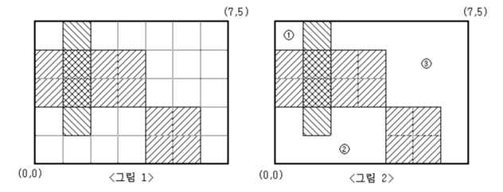

# 요구사항 분석
영역 구하기

- 눈금의 간격이 1인 M×N(M,N≤100)크기의 모눈종이가 있다.
- 이 모눈종이 위에 눈금에 맞추어 K개의 직사각형을 그릴 때, 이들 K개의 직사각형의 내부를 제외한 나머지 부분이 몇 개의 분리된 영역으로 나누어진다.
- M, N과 K 그리고 K개의 직사각형의 좌표가 주어질 때, K개의 직사각형 내부를 제외한 나머지 부분이 몇 개의 분리된 영역으로 나누어지는지
- 그리고 분리된 각 영역의 넓이가 얼마인지를 구하여 이를 출력하는 프로그램을 작성하시오.

## 입력
- 첫째 줄에 M과 N, 그리고 K가 빈칸을 사이에 두고 차례로 주어진다.(M, N, K는 모두 100 이하의 자연수이다.)
- 둘째 줄부터 K개의 줄에는 한 줄에 하나씩
- 직사각형의 왼쪽 아래 꼭짓점의 x, y좌표값과
- 오른쪽 위 꼭짓점의 x, y좌표값이 빈칸을 사이에 두고 차례로 주어진다.
- 모눈종이의 왼쪽 아래 꼭짓점의 좌표는 (0,0)이고, 오른쪽 위 꼭짓점의 좌표는(N,M)이다.
- 입력되는 K개의 직사각형들이 모눈종이 전체를 채우는 경우는 없다. => 빈 공간이 무조건 1개 이상 나온다.

## 출력(목표)
- 첫째 줄에 분리되어 나누어지는 영역의 개수를 출력한다. 
- 둘째 줄에는 각 영역의 넓이를 오름차순으로 정렬하여 빈칸을 사이에 두고 출력한다.

# 왜 코드를 그렇게 작성했는지
- 왜 사각형 좌표를 저따구로 설정해놨는지 모르겠는데 0, 0이 왼쪽 아래고, M, N이 오른쪽 위라는걸 알아둬야함
- 사각형 모양 이상하게 만들어지는거 보고 뭐지 이거 했는데 문제 자체가 이상해게 만듬 누가 만들었냐

- 2차원 배열에서 y가 반전된 버전이라고 생각하고 그래프를 만들어야함
- 직사각형 그릴때 y를 M - y로 주면 반전 좌표로 구해질거 같음

# 핵심 로직
## 1. 직사각형 y좌표 반전해서 넣어주기
- 문제에서 제공하는 영역이 좀 이상하다

- y좌표가 2차원 배열 기준으로 반전되어있음
- 누가 이렇게 만들었냐
- 그래서 직사각형 영역을 표시할때 y좌표는 영역의 세로길이 M에서 y좌표를 빼준 값으로 반전시켜야 정확한 위치를 잡을 수 있음
- 반복문 돌릴때 이를 신경써서 직사각형을 만들어줘야함
```java
// 영역에 직사각형 넣어주기
        for (int i = 0; i < K; i++) {
            st = new StringTokenizer(br.readLine());
            int x1 = Integer.parseInt(st.nextToken());
            int y1 = Integer.parseInt(st.nextToken());
            int x2 = Integer.parseInt(st.nextToken());
            int y2 = Integer.parseInt(st.nextToken());

            // y축의 범위를 반전해서 구하기
            for (int y = M - y2; y < M - y1; y++) {
                for (int x = x1; x < x2; x++) {
                    area[y][x] = 0; // 막힌 영역
                }
            }
        }
```
## 2. 빈 공간의 넓이를 담아줄 배열 만들기
- 이 문제는 단순히 빈 영역의 갯수를 세는게 끝이 아니라 빈 영역의 넓이들도 각각 구해줘야 함
- 빈 영역의 넓이를 담는 리스트를 하나 만들어 DFS를 실행할 때 width값을 측정해 리스트에 담아주면 됨
```java
// 빈 영역 담을 result 변수
List<Integer> result = new ArrayList<>();

// 현재 지역이 빈 영역이고, 방문한 적 없으면 DFS 실행
for (int y = 0; y < M; y++) {
    for (int x = 0; x < N; x++) {
        if (area[y][x] == 1 && !visited[y][x]) {
            // 빈 영역의 넓이값 초기화
            width = 0;
            // DFS 실행
            dfs(x, y);
            // dfs 종료되면 width값 result 배열에 담아주기
            result.add(width);
        }
    }
}
```
- DFS 내부에서 width 전역 변수에 값을 추가하는 로직을 담아 만들어야 함
```java
// DFS
static void dfs(int x, int y) {
    // 방문 체크
    visited[y][x] = true;

    // 8방향 델타로 이동하기(대각선도 인접으로 취급해서)
    for (int i = 0; i < 8; i++) {
        int nx = x + dx[i];
        int ny = y + dy[i];

        if (nx >= 0 && ny >= 0 && nx < w && ny < h) {
            // 방문한 적 없는 땅인 경우 이동
            if (land[ny][nx] == 1 && !visited[ny][nx]) {
                dfs(nx, ny);
            }
        }
    }
}
```


