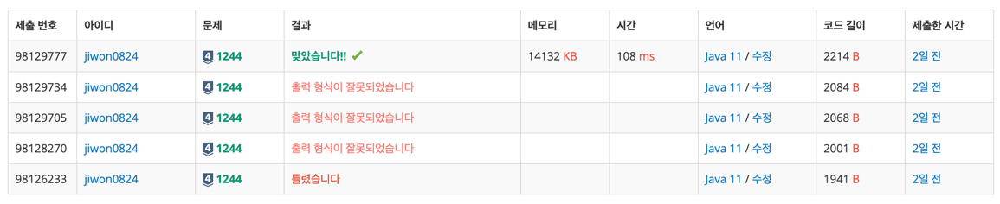

# 요구사항 분석
단순 구현 문제

남학생이면 받은 수의 배수 스위치를 반대로 바꿔줌

여학생이라면 자기가 받은 수와 같은 번호가 붙은 스위치를 중심으로 좌우가 대칭이면서 가장 많은 스위치를 포함하는 구간을 찾아서, 그 구간에 속한 스위치의 상태를 모두 바꾼다.

## 입력
첫째 줄에는 스위치 개수가 주어진다(1 <= n <= 100)

둘째 줄에는 각 스위치의 상태가 주어진다. 켜져 있으면 1, 꺼져있으면 0이라고 표시하고 사이에 빈칸이 하나씩 있다.

셋째 줄에는 학생수가 주어진다(1 <= s <= 100)

넷째 줄부터 마지막 줄까지 한 줄에 한 학생의 성별, 학생이 받은 수가 주어진다(사이에 공백)
- 남학생은 1로, 여학생은 2로 표시
- 학생이 받은 수는 스위치 개수 이하인 양의 정수이다.
## 출력(목표)
스위치의 상태를 1번 스위치에서 시작하여 마지막 스위치까지 한 줄에 20개씩 출력

# 왜 코드를 그렇게 짰는지
단순 구현 문제라서 그냥 문제에 주어진 대로 짰다.

출력이 스위치의 상태를 1번 스위치에서 시작하여 마지막 스위치까지 한 줄에 20개씩 출력이었는데,\
이 조건을 제대로 확인하지 않아서 계속 왜 틀렸지 봤다... 문제 요구사항을 잘 확인할 것.
# 핵심 로직
남학생이면 받은 수의 배수 스위치를 반대로 바꿔줌\
여학생이라면 자기 자신을 바꾸고, 왼쪽 오른쪽 좌표를 하나씩 늘려가면서 같으면 계속 스위치 반전
```java
public static void changeSwitch(int gender, int num) {
    if (gender == BOY) {
        // 남학생은 스위치 번호가 자기가 받은 수의 배수이면, 그 스위치의 상태를 바꾼다.
        for (int i = 1; i <= n; i++) {
            if (i % num == 0) {
                switches[i] = (switches[i] == 0) ? 1 : 0;
            }
        }
    } else {
        // 여학생은 자기가 받은 수와 같은 번호가 붙은 스위치를 중심으로 좌우가 대칭이면서 가장 많은 스위치를 포함하는 구간
        // 에 속한 스위치의 상태를 모두 바꾼다.
        // 일단 자기자신을 바꾸고
        switches[num] = (switches[num] == 0) ? 1 : 0;

        // 대칭인 구간을 양옆으로 확장하면서 
        int left = num - 1;
        int right = num + 1;
        while ((left > 0 && right <= n) && switches[left] == switches[right]) {
            switches[left] = (switches[left] == 0) ? 1 : 0;
            switches[right] = (switches[right] == 0) ? 1 : 0;
            left -= 1;
            right += 1;
        }
    }
}
```
# 제출
