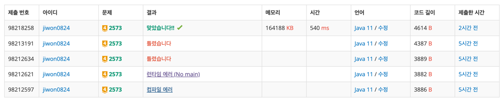

# 요구사항 분석
2차원 배열에 빙산의 높이(1<=h<=10), 바다(0)가 저장되어 있음.

빙산의 높이는 일년마다 상하좌우에 저장된 바다(0)의 개수만큼 줄어듦.

한 덩어리의 빙산이 주어질 때, 이 빙산이 두 덩어리 이상으로 분리되는 최초의 시간(년)을 구하는 프로그램을 작성\
만일 전부 다 녹을 때까지 두 덩어리 이상으로 분리되지 않으면 0을 출력
## 입력
첫 줄에는 이차원 배열의 행의 개수(N)와 열의 개수(M)가 한 개의 빈칸을 사이에 두고 주어진다(3 <= N, M <= 300)

그 다음 N개의 줄에는 각 줄마다 M개의 정수(0 <= h <= 10)가 한 개의 빈 칸을 사이에 두고 주어진다.
배열에서 빙산이 차지하는 칸의 개수, 즉, 1 이상의 정수가 들어가는 칸의 개수는 10,000 개 이하이다.

## 출력(목표)
첫 줄에 빙산이 분리되는 최초의 시간(년)을 출력\
만일 빙산이 다 녹을 때까지 분리되지 않으면 0을 출력
# 왜 코드를 그렇게 짰는지
1. 빙산이 다 녹았는지 체크하는 함수(그냥 2중 for 완탐)
2. 빙산이 2덩어리로 나누어졌는지 확인하는 함수(bfs)
3. 1년 지나면 주변 바다 개수만큼 빙산 높이 감소(그냥 3중 for 완탐)

위 3가지 기능이 필수적으로 필요하다. 2덩어리로 나누어졌는지 확인은 dfs로 해도 상관 없음

# 핵심 로직
1. 빙산이 다 녹았는지 체크하는 함수(그냥 2중 for 완탐)
    - 모든 칸을 돌면서 0이 아닌 칸이 하나라도 있으면 false 반환
2. 빙산이 2덩어리로 나누어졌는지 확인하는 함수(bfs)
    - 모든 점에 대해 bfs해서 몇 개의 덩어리로 나누어졌는지 확인 (2개 이상이면 return true 중도 반환 아니면 return false)
3. 1년 지나면 주변 바다 개수만큼 빙산 높이 감소(그냥 3중 for 완탐)
   - 모든 점에 대해 4방향 for 돌면서 주변 바다 개수 세기 -> `numOfSea` 이차원 배열에 저장
   - 모든 점에 대해 `numOfSea` 이차원 배열을 기반으로 빙산의 높이 감소시키기 0미만으로는 떨어지지 않으므로 `Math.max(map[i][j]-numOfSea[i][j], 0)`으로 처리
## 함수 설명
```java
/**
 * 빙산이 두 덩어리 이상으로 나뉠 때까지 몇 년이 걸리는지 구하는 함수
 * @return  year(빙산이 다 녹았으면 0)
 */
getYear();

/**
 * 모든 칸이 0인지 확인하는 함수
 * @return 모든 칸이 0이면 true 아니면 false(0이 아닌 땅을 만나면 중도 반환)
 */
isAllMelt();

/**
 * 두 덩어리 이상으로 나뉘었는지 체크하는 함수 내부에서 bfs()함수 호출
 * @return cnt>=2라면 true(중도 반환) 아니면 false
 */
isSeparate();

/**
 * startX, startY와 이어진 좌표를 모두 탐색
 * @param startX 시작 x좌표
 * @param startY 시작 y좌표
 * @param visited visited 배열
 */
bfs(int startX, int startY, boolean[][] visited);

/**
 * 1년 뒤 빙산의 상태로 만드는 함수, 내부에서 getSeaCnt 함수 호출
 */
melt();

/**
 * x, y 좌표 주위 4방향에 바다 개수를 세서 반환함
 * @param x x좌표
 * @param y y좌표
 * @return numOfSea 주위 4방향의 바다 개수
 */
getSeaCnt(int x, int y);

/**
 * 매개변수로 들어온 좌표가 배열 범위 내인지 반환
 * @param nx x값 
 * @param ny y값
 * @return nx, ny가 배열 범위 내라면 true, 아니면 false
 */
inRange(int nx, int ny);
```

# 제출


# 오답 코드 및 반례
1년이 지나면 모든 빙산이 동시에 주변 바다 수만큼 잠겨야 하는데, for문을 돌면서 빙산을 하나씩 잠기게 코드를 짰다.\
그래서 이전에 감소시킨 높이가 다음 감소에 영향을 주게 됨(빙산이 0이 돼서 바다가 되면 다음 빙산 주위의 바다 개수가 1 증가되기 때문에)


## 오답 코드
```java
 import java.io.BufferedReader;
import java.io.IOException;
import java.io.InputStreamReader;
import java.util.ArrayDeque;
import java.util.Queue;
import java.util.StringTokenizer;

public class Main {
    public static class Coord{
        int x;
        int y;

        public Coord(int x, int y) {
            this.x = x;
            this.y = y;
        }
    }

    public static int[] dx = {0, 0, 1, -1};
    public static int[] dy = {1, -1, 0, 0};

    public static int n, m;
    public static int[][] map;

    // 완탐으로 모든 칸 주위에 바다 갯수만큼
    public static void main(String[] args) throws IOException {
        BufferedReader br = new BufferedReader(new InputStreamReader(System.in));

        StringTokenizer st = new StringTokenizer(br.readLine());
        n = Integer.parseInt(st.nextToken());
        m = Integer.parseInt(st.nextToken());

        map = new int[n][m];
        for (int i = 0; i < n; i++) {
            st = new StringTokenizer(br.readLine());
            for (int j = 0; j < m; j++) {
                map[i][j] = Integer.parseInt(st.nextToken());
            }
        }

        // [solution] 쪼개졌는지 확인 + 1년 경과
        int year = getYear();
        System.out.println(year);
    }

    private static int getYear() {
        int year = 0;

        while(true){
            // [종료 조건] bfs로 빙산이 두 덩어리 이상으로 분리되었는지 확인 -> true면 종료
            if(isSeparate()){
                return year;
            }

            // [종료 조건] 만일 빙산이 다 녹을 때까지 분리되지 않으면 0
            if(isAllMelt()){
                return 0;
            }

            // 1년 지남
            for (int i = 0; i < n; i++) {
                for (int j = 0; j < m; j++) {
                    // 바다로는 가지 않기
                    if(map[i][j] == 0) continue;

                    int numOfSea = getSeaCnt(i, j);
                    map[i][j] = Math.max(map[i][j] - numOfSea, 0);
                }
            }
            year++;
        }
    }

    private static boolean isAllMelt() {
        for (int i = 0; i < n; i++) {
            for (int j = 0; j < m; j++) {
                // 바다가 아닌 땅이 1개라도 있으면 모두 녹은 게 아님
                if(map[i][j]!=0) return false;
            }
        }
        return true;
    }

    private static boolean isSeparate() {
        int cnt = 0;
        boolean[][] visited = new boolean[n][m];

        for (int i = 0; i < n; i++) {
            for (int j = 0; j < m; j++) {
                // 방문한 칸은 다시 방문하지 않음
                if(visited[i][j]) continue;
                // 바다가 아니면 bfs로 이어진 땅 싹 다 탐색하기
                if(map[i][j]==0) continue;

                bfs(i, j, visited);
                cnt++;

                //System.out.println(cnt);
                if(cnt>=2) return true;
            }
        }

        return false;
    }

    private static void bfs(int startX, int startY, boolean[][] visited) {

        Queue<Coord> queue = new ArrayDeque<>();

        // 시작점 넣기(방문 예약)
        queue.offer(new Coord(startX, startY));
        visited[startX][startY] = true;

        while(!queue.isEmpty()){
            Coord curr = queue.poll();

            // 4방향 탐색하기
            for (int dir = 0; dir < 4; dir++) {
                int nx = curr.x + dx[dir];
                int ny = curr.y + dy[dir];

                // 배열 범위를 벗어남 || 이미 방문했던 땅
                if(!inRange(nx, ny) || visited[nx][ny]) continue;

                // 바다로는 가지 않음
                if(map[nx][ny] == 0) continue;

                queue.offer(new Coord(nx, ny));
                visited[nx][ny] = true;
            }

        }
    }

    private static int getSeaCnt(int x, int y) {
        int cnt = 0;
        for(int dir = 0; dir<4; dir++){
            int nx = x + dx[dir];
            int ny = y + dy[dir];

            // 범위를 벗어났는지 확인
            if(!inRange(nx, ny)) continue;

            // 바다면 count 1증가
            if(map[nx][ny]==0) cnt++;
        }
        return cnt;
    }

    private static boolean inRange(int nx, int ny) {
        return nx >= 0 && nx < n && ny >= 0 && ny < m;
    }

}
```
## 반례
```declarative
5 5
0 0 0 0 0
0 1 1 1 0
0 1 0 1 0
0 1 1 1 0
0 0 0 0 0
```