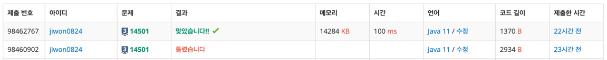

# 요구사항 분석
오늘부터 N+1일째 되는 날 퇴사를 하기 위해서, 남은 N일 동안 최대한 많은 상담을 하려고 한다.\
상담을 하는데 필요한 기간은 1일보다 클 수 있기 때문에, 모든 상담을 할 수는 없다.\
또한, N+1일째에는 회사에 없기 때문에, 6, 7일에 있는 상담을 할 수 없다.

## 입력
첫째 줄에 N (1 ≤ N ≤ 15)

둘째 줄부터 N개의 줄에 Ti와 Pi가 공백으로 구분되어서 주어지며,\
1일부터 N일까지 순서대로 주어진다. (1 ≤ Ti ≤ 5, 1 ≤ Pi ≤ 1,000)
## 출력(목표)
첫째 줄에 백준이가 얻을 수 있는 최대 이익을 출력

# 왜 코드를 그렇게 짰는지
그리디로 풀었는데, 틀려서 지피티한테 물어봤더니 dp로 풀어야 한다고 했다.

dp[i]: i일까지 고려했을 때 최대 이익(0-1 knapsack 문제: 하나의 상담을 여러 번 진행할 수 없으므로)

# 핵심 로직
일차원 배열이고, 0-1 knapsack 문제니까 뒤에서부터 상담을 넣어줘야 한다.
```java
// dp[i]: i일부터 퇴사일까지 최대 이익
int[] dp = new int[n + 2];
for (int i = n; i >= 0; i--) {
    int endDay = i + t[i]; // 상담 종료일
    if (endDay <= n + 1) { // 퇴사일보다 작으면
        // dp[i+1] = 상담 안 하는 경우, dp[endDay]+p[i] = 상담하는 경우
        dp[i] = Math.max(dp[i + 1], dp[endDay] + p[i]);
    } else { // 오늘 상담하면 퇴사일 넘음 → 오늘은 못함
        dp[i] = dp[i + 1];
    }
}
```
# 제출


# 틀린 코드
회의실 배정이랑 비슷한 문제라고 생각해서, 이익이 큰 상담(같다면 기간이 짧은 순으로) 정렬한 후, 사용일을 체크해서 사용할 수 있으면 해당 상담을 진행하는 방식으로 진행했다.
## 반례
```declarative
5
5 50
2 30
2 30
2 30
1 1

정답: 60
출력: 50
```
## 전체 코드(그리디)
```java
package Sep_25.week02.박지원;

import java.io.BufferedReader;
import java.io.IOException;
import java.io.InputStreamReader;
import java.util.Arrays;
import java.util.Comparator;
import java.util.StringTokenizer;

public class boj_14501 {

    public static class Consulting implements Comparable<Consulting> {
        int start;
        int end;
        int profit;

        public Consulting(int start, int end, int profit) {
            this.start = start;
            this.end = end;
            this.profit = profit;
        }

        @Override
        public int compareTo(Consulting o) {
            if (o.profit == this.profit) {
                return this.end - o.end;
            }
            return o.profit - this.profit;
        }

        // 디버깅용
        @Override
        public String toString() {
            return "Consulting{" +
                    "start=" + start +
                    ", end=" + end +
                    ", profit=" + profit +
                    '}';
        }
    }

    // 오늘부터 N+1일째 되는 날 퇴사를 하기 위해서, 남은 N일 동안 최대한 많은 상담을 하려고 한다.
    public static void main(String[] args) throws IOException {
        BufferedReader br = new BufferedReader(new InputStreamReader(System.in));
        int n = Integer.parseInt(br.readLine());

        Consulting[] consultings = new Consulting[n + 1];
        consultings[0] = new Consulting(-1, -1, -1);
        for (int startDay = 1; startDay <= n; startDay++) {
            StringTokenizer st = new StringTokenizer(br.readLine());

            int duration = Integer.parseInt(st.nextToken());
            int profit = Integer.parseInt(st.nextToken());

            // 마지막에 1일짜리 상담이 있으면 고려해야함
            if (startDay + duration > n+1) consultings[startDay] = new Consulting(startDay, -1, -1);
            else consultings[startDay] = new Consulting(startDay, startDay + duration, profit);
        }

        Arrays.sort(consultings);

        boolean[] used = new boolean[n + 1];
        int sum = 0;
        for (int i = 0; i <= n; i++) {
            Consulting curr = consultings[i];
            if (curr.end == -1) continue;

            // 상담 가능하면 상담 하고 이익 증가
            if (canUse(curr.start, curr.end, used)) {
                for (int day = curr.start; day < curr.end; day++) {
                    used[day] = true;
                }
                sum += curr.profit;
            }
        }

//        for (int i = 0; i <= n; i++) {
//            System.out.println(consultings[i]);
//        }
//        for (int i = 0; i <= n; i++) {
//            System.out.print(used[i] + " ");
//        }

        System.out.println(sum);
    }

    private static boolean canUse(int start, int end, boolean[] used) {
        for (int day = start; day < end; day++) {
            if (used[day]) return false;
        }
        return true;
    }
}

```