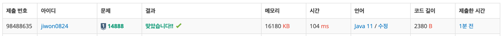

# 요구사항 분석
N개의 수로 이루어진 수열 A1, A2, ..., AN이 주어진다.\
또, 수와 수 사이에 끼워넣을 수 있는 N-1개의 연산자가 주어진다.\
연산자는 덧셈(+), 뺄셈(-), 곱셈(×), 나눗셈(÷)으로만 이루어져 있다.\

우리는 수와 수 사이에 연산자를 하나씩 넣어서, 수식을 하나 만들 수 있다. 이때, 주어진 수의 순서를 바꾸면 안 된다.\
**식의 계산은 연산자 우선 순위를 무시하고 앞에서부터 진행해야 한다.**\
또, 나눗셈은 정수 나눗셈으로 몫만 취한다. 음수를 양수로 나눌 때는 양수로 바꾼 뒤 몫을 취하고, 그 몫을 음수로 바꾼 것과 같다.

## 입력
첫째 줄에 수의 개수 N(2 ≤ N ≤ 11)가 주어진다.\
둘째 줄에는 A1, A2, ..., AN이 주어진다. (1 ≤ Ai ≤ 100)\
셋째 줄에는 합이 N-1인 4개의 정수가 주어지는데, 차례대로 덧셈(+)의 개수, 뺄셈(-)의 개수, 곱셈(×)의 개수, 나눗셈(÷)의 개수이다.
## 출력(목표)
첫째 줄에 만들 수 있는 식의 결과의 최댓값을, 둘째 줄에는 최솟값을 출력

# 왜 코드를 그렇게 짰는지
중복순열은 카운팅 기반의 dfs로 풀 수 있다.
swea에 같은 문제가 있었음

# 핵심 로직
lhs 좌항과 numbers[idx]를 우항으로 하여 연산자를 사이사이에 넣으면서 연산을 끝내면 최대/최소값을 갱신한다.\
나눗셈의 경우 음수 나눗셈이 있을 수 있다고 나왔으므로, 문제에 제시된 대로 연산을 처리해준다.
```java
private static void dfs(int idx, int lhs, int add, int sub, int mul, int div) {
    // 계산 끝났으면 최대 최소 결과 갱신해줘야 함
    if (idx == n) {
        maxResult = Math.max(maxResult, lhs);
        minResult = Math.min(minResult, lhs);
        return;
    }

    // 계산해야 할 값
    int rhs = numbers[idx];

    if (add > 0) {
        dfs(idx + 1, lhs + rhs, add - 1, sub, mul, div);
    }
    if (sub > 0) {
        dfs(idx + 1, lhs - rhs, add, sub - 1, mul, div);
    }
    if (mul > 0) {
        dfs(idx + 1, lhs * rhs, add, sub, mul - 1, div);
    }
    if (div > 0) {
        // rhs는 항상 양수(1 ≤ Ai ≤ 100)
        if (lhs < 0) {
            lhs *= -1; // 음수면 양수로 만든 다음에
            dfs(idx + 1, lhs / rhs * -1, add, sub, mul, div - 1);
        } else {
            dfs(idx + 1, lhs / rhs, add, sub, mul, div - 1);
        }
    }
}
```
# 제출


