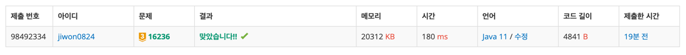

# 요구사항 분석
n*n배열
- 0: 빈 칸
- 1, 2, 3, 4, 5, 6: 칸에 있는 물고기의 크기
- 9: 아기 상어의 위치

가장 처음에 아기 상어의 크기는 2이고, 아기 상어는 1초에 상하좌우로 인접한 한 칸씩 이동

크기가 큰 물고기
- 먹을 수 X
- 지나갈 수 X

크기가 같은 물고기
- 먹을 수 X
- 지나갈 수 O

크기가 작은 물고기
- 먹을 수 O
- 지나갈 수 O

먹을 수 있는 물고기 없음 →
먹을 수 있는 물고기 있음
- 1마리라면 먹으러 가기
- 많으면 가장 거리가 가까운 물고기부터 
  - 거리는 아기 상어가 있는 칸에서 물고기가 있는 칸으로 이동할 때, 지나야하는 칸의 개수의 최솟값
- 거리가 같으면 위쪽 우선, 위쪽이 많으면 왼쪽 우선

아기 상어가 몇 초 동안 엄마 상어에게 도움을 요청하지 않고 물고기를 잡아먹을 수 있는지 구하는 프로그램 작성

## 입력
첫째 줄에 공간의 크기 N(2 ≤ N ≤ 20)이 주어진다\
둘째 줄부터 N개의 줄에 공간의 상태가 주어진다. 공간의 상태는 0, 1, 2, 3, 4, 5, 6, 9
- 0: 빈 칸
- 1, 2, 3, 4, 5, 6: 칸에 있는 물고기의 크기
- 9: 아기 상어의 위치

## 출력(목표)
첫째 줄에 아기 상어가 엄마 상어에게 도움을 요청하지 않고 물고기를 잡아먹을 수 있는 시간을 출력

# 왜 코드를 그렇게 짰는지
음... 혼자서 풀었는데, 테케랑 다른 답이 나와서 어디가 틀렸는지 지피티한테 물어봤다.\
상어 위치에서 다른 모든 칸으로의 이동시간을 dist 이차원배열에 저장하고, 최적의 물고기를 찾아서 

# 핵심 로직
1. bfs로 모든 칸까지의 거리를 이차원 배열로 받기(자기보다 큰 물고기가 있는 칸은 지나갈 수 없으므로, bfs로 최단거리를 구해야 한다.)
2. 목표 물고기를 선택해야 하는데, Fish 클래스 안에 선언한 compareTo를 이용해서 우선순위가 높은 물고기를 타겟으로 선택함`fish.compareTo(target) < 0`
3. 목표 물고기까지의 거리 `dist[target.x][target.y]==target.distFromShark`를 totalTime에 더해준다.
4. 상어를 목표 물고기 위치로 옮기고, 물고기 먹힘 처리`fish.isEaten=true`, 물고기가 있던 자리 `map[target.x][target.y] = 0` 없애기. 먹은 물고기 갯수 증가, 상어 사이즈==먹은 갯수라면 상어 사이즈 증가
```java
while (true) {
    // 상어 위치 기준 모든 칸 최단거리 계산
    int[][] dist = bfsAll(shark);

    // 목표 물고기 선택하기
    Fish target = null;
    for (Fish fish : fishes) {
        // 이미 먹은 것, 크기가 크거나 같은 물고기는 못 먹음
        if (fish.isEaten) continue;
        if (fish.size >= shark.size) continue;

        int d = dist[fish.x][fish.y];
        if (d == -1) continue;                  // 도달 불가

        fish.distFromShark = d;
        // fish.compareTo(target) 지금 물고기랑 타겟 물고기 비교해서 0보다 작음-> 우선순위 높음
        if (target == null || fish.compareTo(target) < 0) {
            target = fish;
        }
    }

    // 더 이상 먹을 수 있는 물고기가 없으면 종료
    if (target == null) break;

    // 이동 시간 누적 및 지도/상태 업데이트
    totalTime += target.distFromShark;

    // 상어 이동
    shark.x = target.x;
    shark.y = target.y;

    // 물고기 먹음 처리
    target.isEaten = true;
    map[target.x][target.y] = 0;

    // 성장 처리
    shark.eatCount++;
    if (shark.eatCount == shark.size) {
        shark.size++;
        shark.eatCount = 0;
    }
}
```

# 제출

# 틀린 코드
## 틀린 이유
1. 문제를 잘못 이해함.\
크기가 작거나 같은 물고기를 먹을 수 있고, 먹을 때마다 크기가 커지는 줄 알았는데, 먹은 개수가 상어 사이즈랑 같을 때마다 크기가 커지는 거였음\
2. 상어에서 물고기까지의 거리를 맨해튼 거리로 단순화 했음\
문제에서 요구한 것은 상어에서 물고기까지의 거리, 자기보다 큰 물고기는 지나갈 수 없음 -> bfs로 거리를 측정해야 함
3. 지도 업데이트 누락
상어의 위치만 바꿔주고, 지도에는 물고기 상태, 상어의 위치를 반영해주지 않음(원래 상어위치는 0, 물고기 위치는 9(상어)로 변경해주었어야 함)

## 틀린 코드 전체
```java

package Sep_25.week02.박지원;

import java.io.BufferedReader;
import java.io.IOException;
import java.io.InputStreamReader;
import java.util.*;

public class boj_16236 {
    public static class Coord{
        int x;
        int y;
        int time;

        public Coord(int x, int y, int time) {
            this.x = x;
            this.y = y;
            this.time = time;
        }
    }

    public static class Shark{
        int x;
        int y;
        int size;

        public Shark(int x, int y, int size) {
            this.x = x;
            this.y = y;
            this.size = size;
        }
    }

    public static class Fish implements Comparable<Fish>{
        int x;
        int y;
        int size;
        int distFromShark;
        boolean isEaten;

        public Fish(int x, int y, int size, int distFromShark) {
            this.x = x;
            this.y = y;
            this.size = size;
            this.distFromShark = distFromShark;
            isEaten = false;
        }

        @Override
        public int compareTo(Fish o) {
            // 거리가 동일하면 위쪽부터
            if(this.distFromShark == o.distFromShark){
                // 그런 물고기가 많으면 왼쪽부터
                if(this.x==o.x){
                    return this.y-o.y;
                }
                return this.x-o.y;
            }
            // 거리순으로 접근
            return this.distFromShark-o.distFromShark;
        }
    }


    public static int[] dx = {0, 0, 1, -1};
    public static int[] dy = {1, -1, 0, 0};

    public static int n;
    public static int[][] map;

    public static List<Fish> fishes;
    private static int totalTime;

    public static void main(String[] args) throws IOException {
        BufferedReader br = new BufferedReader(new InputStreamReader(System.in));
        n = Integer.parseInt(br.readLine());

        map = new int[n][n];
        Shark shark = new Shark(-1, -1, -1); // 초기화
        fishes = new ArrayList<>();
        for (int i = 0; i < n; i++) {
            StringTokenizer st = new StringTokenizer(br.readLine());
            for (int j = 0; j < n; j++) {
                map[i][j] = Integer.parseInt(st.nextToken());
                if(map[i][j]==9){
                    // shark의 초기 위치와 size
                    shark = new Shark(i, j, 2);
                }
            }
        }

        // 물고기 리스트 만들기
        for (int i = 0; i < n; i++) {
            for (int j = 0; j < n; j++) {
                if (1 <= map[i][j] && map[i][j] <= 9) {
                    int distFromShark = Math.abs(shark.x-i) + Math.abs(shark.y- j);
                    // x, y, size, distFromShark
                    fishes.add(new Fish(i, j, map[i][j], distFromShark));
                }
            }
        }

        while(true){
            // 정렬
            Collections.sort(fishes); // compareTo에 정의한 순서대로 정렬됨

            Fish targetFish = findTargetFish(shark.size);

            // 먹을 수 있는 물고기가 없으면 반복 종료
            if(targetFish==null){
                break;
            }

            // 상어 위치에서 물고기 위치까지 bfs로 최단거리 찾기
            totalTime += bfs(shark, targetFish);

            // 물고기 먹음 상태 변경
            targetFish.isEaten = true;
            
            // 상어의 위치가 변경됨
            shark.x = targetFish.x;
            shark.y = targetFish.y;
            shark.size++;

            // 상어의 위치가 바뀔 때마다 물고기들의 distFromShark 재계산
            calcDistFromShark(shark.x, shark.y);
        }
        System.out.println(totalTime);
    }

    private static void calcDistFromShark(int x, int y) {
        for (Fish fish : fishes) {
            fish.distFromShark = Math.abs(x- fish.x) + Math.abs(y- fish.y);
        }
    }

    private static int bfs(Shark shark, Fish targetFish) {

        Queue<Coord> queue = new ArrayDeque<>();
        boolean[][] visited = new boolean[n][n];

        queue.offer(new Coord(shark.x, shark.y, 0));
        visited[shark.x][shark.y] = true;

        while(!queue.isEmpty()){
            Coord curr = queue.poll();

            // targetFish를 찾았으면 time 반환
            if(curr.x == targetFish.x && curr.y == targetFish.y){
                return curr.time;
            }

            for (int dir = 0; dir < 4; dir++) {
                int nx = curr.x +dx[dir];
                int ny = curr.y +dy[dir];

                // 배열 범위 밖 || 이미 방문한 칸 -> 무시
                if(nx<0 ||nx>=n || ny<0 || ny >=n) continue;
                if(visited[nx][ny]) continue;

                // 아기 상어는 자신의 크기보다 큰 물고기가 있는 칸은 지나갈 수 없고
                if(map[nx][ny]>shark.size) continue;

                // 방문 예약
                queue.offer(new Coord(nx, ny, curr.time+1));
                visited[nx][ny] = true;
            }
        }

        // 여기로는 올 일 없음
        return -1;
    }

    private static Fish findTargetFish(int sharkSize) {
        for (Fish fish : fishes) {
            if(fish.isEaten) continue;
            if(fish.size > sharkSize) continue;

            return fish;
        }

        return null;
    }
}
```


