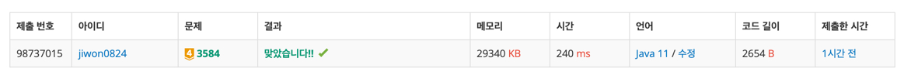

# 요구사항 분석
두 노드의 가장 가까운 공통 조상은, 두 노드를 모두 자손으로 가지면서 깊이가 가장 깊은(즉 두 노드에 가장 가까운) 노드

루트가 있는 트리가 주어지고, 두 노드가 주어질 때 그 두 노드의 가장 가까운 공통 조상을 찾는 프로그램
## 입력
테스트케이스 갯수\
각 테스트케이스의 노드 개수\
노드 개수-1개의 간선 정보\
lca 찾고 싶은 두 노드

노드 번호는 1이상 n(2 ≤ N ≤ 10,000)이하
## 출력(목표)

# 왜 코드를 그렇게 짰는지
최소 공통 조상을 어떻게 찾는지 개념만 한 번 찾아봤다.

부모 노드를 저장하는 배열, 깊이를 저장하는 배열을 하나 선언해서 채워준다.

깊이가 다르면 같아질 때까지 깊이가 깊은 애를 a = parent[a] 이런 식으로 올려준다

깊이가 같아지면 거기서부터 a와 b가 같아질 때까지 부모노드 → 부모노드 이런 식으로 올려주면 된다.

같아진 노드가 최소 공통 조상

# 핵심 로직
## main()
1. root노드를 모르니까 parent가 없는 애 찾아서 root로 저장
2. root에서 시작해서 각 노드의 depth 구해주기
3. lca 구해서 출력
```java
// 루트 모르니까 parent 없는 놈이 루트임
int root = -1;
for (int i = 1; i <= n; i++) {
    if(parent[i]==0){
        root = i;
        break;
    }
}

// level(=depth) 배열 채우기 위한 dfs
dfs(root, 0);

// lca 구해서 출력하기
System.out.println(getLca(a, b));
```
## dfs(): level(=depth) 구하기
```java
public static void dfs(int curr, int depth){
    level[curr] = depth;

    for (Integer next : graph[curr]) {
        dfs(next, depth+1);
    }
}
```
## getLca(): a와 b의 공통 조상 구하기
```java
private static int getLca(int a, int b) {
    // level(depth)이 다르면 같게 해줘야 함
    while(level[a]!=level[b]){
        if(level[a]>level[b]){
            a = parent[a];
        }else{
            b = parent[b];
        }
    }

    // a랑 b가 같아질 때까지 올려주기
    while (a!=b){
        a = parent[a];
        b = parent[b];
    }

    return a;
}
```
# 제출
