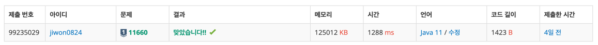

# 요구사항 분석

N×N개의 수가 N×N 크기의 표에 채워져 있다. (x1, y1)부터 (x2, y2)까지 합을 구하는 프로그램

## 입력

[첫째 줄] 표의 크기 N(1 ≤ N ≤ 1024)과 합을 구해야 하는 횟수 M(1 ≤ M ≤ 100,000)

[둘째 줄~N개의 줄] 표에 채워져 있는 수가 1행부터 차례대로 주어진다.

[다음 M개의 줄] 네 개의 정수 x1, y1, x2, y2(x1 ≤ x2, y1 ≤ y2)가 주어지며, 표에 채워져 있는 수는 1,000보다 작거나 같은 자연수이다.

## 출력(목표)

총 M줄에 걸쳐 (x1, y1)부터 (x2, y2)까지 합을 구해 출력

# 왜 코드를 그렇게 짰는지

몇 번 풀어본 유형. 아래와 같은 방식으로 누적합 배열을 만들어서 풀면 된다.

내 위 사각형 + 내 왼쪽 사각형 - 내 왼쪽 대각선 사각형(중복으로 더해지는 부분) + 현재 칸

x1, y1, x2, y2가 주어질 때도 똑같이 풀면 된다.

(x2, y2)까지의 합을 먼저 구한 다음, -(x2, y1-1) - (x1-1, y2)를 해주고, 중복으로 빠지는 부분(x1-1, y1-1)을 더해주면 된다

# 핵심 로직

```java
public static void main(String[] args) throws IOException {
    prefixSum = new int[n + 1][n + 1];
    for (int i = 1; i <= n; i++) {
        st = new StringTokenizer(br.readLine());
        for (int j = 1; j <= n; j++) {

            int val = Integer.parseInt(st.nextToken());

            prefixSum[i][j] = prefixSum[i - 1][j] + prefixSum[i][j - 1] - prefixSum[i - 1][j - 1] + val;
        }
    }

    // m개의 구간 합 구하기
    for (int i = 0; i < m; i++) {
        st = new StringTokenizer(br.readLine());
        int x1 = Integer.parseInt(st.nextToken());
        int y1 = Integer.parseInt(st.nextToken());
        int x2 = Integer.parseInt(st.nextToken());
        int y2 = Integer.parseInt(st.nextToken());

        int answer = prefixSum[x2][y2] - prefixSum[x1 - 1][y2] - prefixSum[x2][y1 - 1] + prefixSum[x1 - 1][y1 - 1];
        System.out.println(answer);
    }
}
```

# 제출

