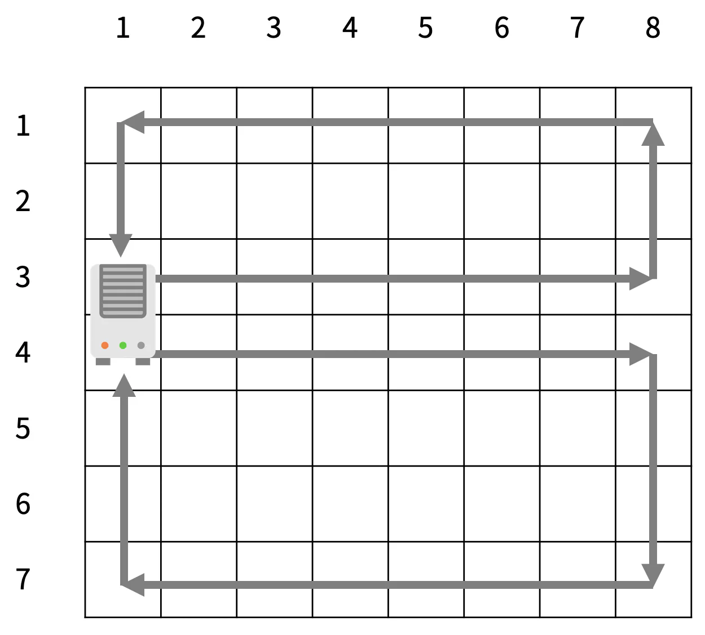

# 요구사항 분석

집: 크기가 R×C인 격자판

각 칸 (r, c)에 있는 미세먼지의 양을 실시간으로 모니터링하는 시스템을 개발했다. (r, c)는 r행 c열을 의미

공기청정기는 항상 1번 열에 설치되어 있고, 크기는 두 행을 차지한다.
공기청정기가 설치되어 있지 않은 칸에는 미세먼지가 있고, (r, c)에 있는 미세먼지의 양은 Ar,c이다.

1초 동안 아래 적힌 일이 순서대로 일어난다.

1. 미세먼지 확산
    1. 4방향(인접한 방향에 공기청정기가 있거나, 칸이 없으면 그 방향으로는 확산이 일어나지 않는다.)
    2. 확산 되는 양 a[r][c]/5 소수점 이하 버림
    3. a[r][c] = a[r][c] - a[r][c]/5⌋×(확산된 방향의 개수)
2. 공청기 작동
    1. 아래 사진과 같이 미세먼지가 한 칸씩 이동
       

## 입력

첫째 줄에 R, C, T (6 ≤ R, C ≤ 50, 1 ≤ T ≤ 1,000)
둘째 줄부터 R개의 줄에 Ar,c (-1 ≤ Ar,c ≤ 1,000)가 주어진다. 공기청정기가 설치된 곳은 Ar,c가 -1이고, 나머지 값은 미세먼지의 양

## 출력(목표)

첫째 줄에 T초가 지난 후 구사과 방에 남아있는 미세먼지의 양을 출력한다.

# 왜 코드를 그렇게 짰는지

공청기가 움직이지 않으니까 공청기 위치를 저장해두고, 지문에 나온 기능을 단순 구현하면 된다고 생각함

1. 확산

   4방향 확산이 일어남 -> dx, dy

   확산이 동시에 일어나므로 새 배열을 만들어서 각 칸에 미세먼지 + 확산을 계속 더해주면 됨

2. 공청기 작동

   그림에 주어진 대로 배열 shift해주면 됨.

   이전의 값이 계속 복사 되거나 하지 않도록 주의하면서 shift 방향의 끝점에서부터 복사 진행

# 핵심 로직

`diffusion()` 미세 먼지 확산하는 함수

`shift()` 공청기에서 나온 바람에 따라 먼지를 한 칸씩 이동시키는 함수

```java
// 1. 미세먼지 확산
private static void diffusion() {
    int[][] afterStatus = new int[r][c];

    for (int x = 0; x < r; x++) {
        for (int y = 0; y < c; y++) {
            // 확산되는 양(=4방향에 더해줄 값)
            int amount = map[x][y] / 5;
            if (amount == 0) {
                afterStatus[x][y] += map[x][y];
                continue;
            }

            int cnt = 0; // 확산된 방향의 개수
            for (int dir = 0; dir < 4; dir++) {
                int nx = x + dx[dir];
                int ny = y + dy[dir];
                if (nx < 0 || nx >= r || ny < 0 || ny >= c || map[nx][ny] == -1) continue;
                afterStatus[nx][ny] += amount;
                cnt++;
            }

            // 남은 미세먼지 양
            int remain = map[x][y] - amount * cnt;
            afterStatus[x][y] += remain;
        }
    }

    // 확산 한 번에 적용하기
    map = afterStatus;
    // 공청기 위치 다시 적어주기
    map[airCleaner[0].x][airCleaner[0].y] = -1;
    map[airCleaner[1].x][airCleaner[1].y] = -1;
}

// 2. 공청기 작동
private static void shift() {
    int ax = airCleaner[0].x;
    int ay = airCleaner[0].y;
    // 위쪽 공기청정기의 바람은 반시계방향으로 순환
    // [top cleaner] ↓ down shift
    for (int x = ax - 1; x > 0; x--) {
        map[x][ay] = map[x - 1][ay];
    }
    // [top cleaner] ← left shift
    for (int y = 0; y < c - 1; y++) {
        map[0][y] = map[0][y + 1];
    }
    // [top cleaner] ↑ up shift
    for (int x = 0; x < ax; x++) {
        map[x][c - 1] = map[x + 1][c - 1];
    }
    // [top cleaner] → right shift
    for (int y = c - 1; y > 1; y--) {
        map[ax][y] = map[ax][y - 1];
    }
    map[ax][ay + 1] = 0;

    // 아래쪽 공기청정기의 바람은 시계방향으로 순환
    ax = airCleaner[1].x;
    ay = airCleaner[1].y;
    // [bottom cleaner] ↑ up shift
    for (int x = ax + 1; x < r - 1; x++) {
        map[x][0] = map[x + 1][0];
    }
    // [bottom cleaner] ← left shift
    for (int y = 0; y < c - 1; y++) {
        map[r - 1][y] = map[r - 1][y + 1];
    }
    // [bottom cleaner] ↓ down shift
    for (int x = r - 1; x > ax; x--) {
        map[x][c - 1] = map[x - 1][c - 1];
    }
    // [bottom cleaner] → right shift
    for (int y = c - 1; y > 1; y--) {
        map[ax][y] = map[ax][y - 1];
    }
    map[ax][ay + 1] = 0;
}
```

# 제출


# 아쉬움

shift하는 부분에 중복 코드가 많이 들어가서 깔끔하게 만들면 좋았을 거 같다.

배열이 아니라 `Map<Coord, Int>` 이렇게 해서 각 좌표의 미세 먼지를 저장하면 조금 더 빠르려나?

