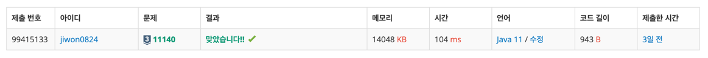

# 요구사항 분석

단어 하나가 주어질 때 단어에 'lol'이 들어가도록

1. 글자를 추가하거나
2. 변경하거나
3. 삭제하는

당신은 지민이보다 프로그래밍을 못하기 때문에 추가/삭제/변경할 글자수의 최솟값을 출력

## 입력

첫 번째 줄에 테스트케이스의 수 T(0 < T ≤ 100)가 주어진다.

두 번째 줄부터 T+1번째 줄까지 단어가 하나씩 주어진다. 단어는 영어 소문자로만 이루어져 있다. 단어의 최대 길이는 50글자이다.

## 출력(목표)

각 단어마다 해당 단어에 몇 개의 글자를 추가/수정/삭제해야 'lol'이라는 부분 문자열이 생기는지 출력

# 왜 코드를 그렇게 짰는지

뭔가 전에 싸피에서 배웠던 트라이를 쓰면 될 거 같다고 생각했는데, 실버라서 그렇게 어려운 알고리즘을 안 써도 될 거 같다고 생각했다(트라이 쓰는 방법 모르기도 하고...)

완전 탐색으로 코드를 짜면 되나? 하고 이중반복문을 짜다가 어떻게 해야할지 도저히 모르겠어서 정답 코드를 찾아봤다...

if 반복문으로 처리하면 되더라...

# 핵심 로직

1. String에 이미 lol이라는 문자열이 포함되어 있는 경우 -> 0번의 연산
2. lo, ol, ll(추가), lxl(변경)은 1번의 연산으로 됨
3. l, o만 있으면 2개 추가하거나 변경하면 됨
4. 그 외에는 l, o, l 다 추가해야 함

```java
private static int minCnt(String str) {
    // 1. 이미 완성된 경우
    if (str.contains("lol")) return 0;

    // 2. 1개만 추가하면 되는 경우
    if (str.contains("lo") || str.contains("ol") || str.contains("ll")) return 1;

    for (int i = 0; i + 2 < str.length(); i++) {
        if (str.charAt(i) == 'l' && str.charAt(i + 2) == 'l') return 1;
    }

    if (str.contains("l") || str.contains("o")) return 2;

    return 3;
}
```

# 제출

