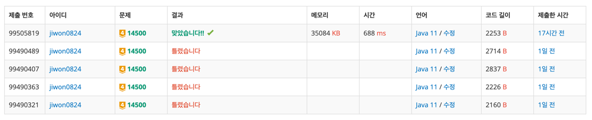

# 요구사항 분석

아래 5개의 블럭을 회전, 대칭시켜서 종이 위에 배치


테트로미노 하나를 적절히 놓아서 테트로미노가 놓인 칸에 쓰여 있는 수들의 합을 최대로 하는 프로그램

## 입력

첫째 줄: 종이의 세로N * 가로M(4 ≤ N, M ≤ 500)

둘째 줄: N개의 줄에 종이에 쓰여 있는 수가 주어진다. i번째 줄의 j번째 수는 위에서부터 i번째 칸, 왼쪽에서부터 j번째 칸에 쓰여 있는 수이다. 입력으로 주어지는 수는 1,000을 넘지 않는 자연수이다.

## 출력(목표)

테트로미노가 놓인 칸에 쓰인 수들의 합의 최댓값을 출력

# 왜 코드를 그렇게 짰는지

1) 처음에는 모든 블록에 대한 경우의 수를 모두 작성했다(19가지)

```java
// ㅡ
{{0,0},{0,1},{0,2},{0,3}},
// ㅣ
        {{0,0},{1,0},{2,0},{3,0}},

// ㅁ
        {{0,0},{0,1},{1,0},{1,1}},

// ㄴ
        {{0,0},{1,0},{2,0},{2,1}},
        {{0,1},{1,1},{2,1},{2,0}},
        {{0,0},{0,1},{1,0},{2,0}},
        {{0,0},{0,1},{1,1},{2,1}},

// ㄴ 대칭
        {{0,0},{0,1},{1,1},{2,1}},
        {{0,0},{1,0},{2,0},{0,1}},
        {{0,0},{1,0},{1,1},{1,2}},
        {{0,2},{1,0},{1,1},{1,2}},

// ㄹ 
        {{0,0},{0,1},{1,1},{1,2}},
// ㄹ 대칭
        {{0,1},{0,2},{1,0},{1,1}},

// ㅗ
        {{0,0},{0,1},{0,2},{1,1}},
        {{0,1},{1,0},{1,1},{2,1}},
        {{1,0},{1,1},{1,2},{0,1}},
        {{0,0},{1,0},{2,0},{1,1}},
```

작 작동하지 않아서 다른 방법을 찾아봄

2) dfs를 이용한 방법

블럭이 4개의 방향으로 이어져 있으므로 깊이 4까지 4가지 방향을 탐색하도록 코드를 짜면 된다.

'ㅗ'모양의 경우 직접 탐색하여 만들 수 없으므로 visited 체크만 하고, 제자리에 있어야 해당 모양을 만들 수 있음

# 핵심 로직

x, y는 현재 좌표, cnt는 지금까지 선택된 블럭의 개수, sum은 블럭을 선택한 칸에 적힌 수의 합

```java
public static void dfs(int x, int y, int cnt, int sum) {

    // 블럭 4개 다 모았으면 answer 갱신
    if (cnt == 4) {
        answer = Math.max(answer, sum);
        return;
    }

    // 4방향 탐색(백트래킹)
    for (int dir = 0; dir < 4; dir++) {
        int nx = x + dx[dir];
        int ny = y + dy[dir];
        // 배열 밖, 방문한 곳
        if (nx < 0 || nx >= n || ny < 0 || ny >= m || visited[nx][ny]) continue;

        // ㅗ 처리(직접 가지 않고, 제자리에서 방문체크만)
        if (cnt == 2) {
            visited[nx][ny] = true;
            dfs(x, y, cnt + 1, sum + arr[nx][ny]);
            visited[nx][ny] = false;
        }

        // 직접 찾아가는 블록 탐색
        visited[nx][ny] = true;
        dfs(nx, ny, cnt + 1, sum + arr[nx][ny]);
        visited[nx][ny] = false;
    }
}
```

# 제출


