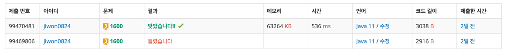

# 요구사항 분석

말 이동(체스의 나이트 이동)을 k번 할 수 있고, 일반 상하좌우 이동을 할 수 있다.

왼쪽 위에서 오른쪽 아래까지 올 수 있으면 최소 이동 횟수를 출력하고, 불가능하면 -1을 출력

## 입력

첫째 줄: 정수 K

둘째 줄: 격자판의 가로길이 W, 세로길이 H

그 다음 H줄에 걸쳐 W개의 숫자(0은 아무것도 없는 평지, 1은 장애물을 뜻)

## 출력(목표)

첫째 줄에 원숭이의 동작수의 최솟값을 출력한다. 시작점에서 도착점까지 갈 수 없는 경우엔 -1을 출력

# 왜 코드를 그렇게 짰는지

2차원으로 했는데, 안 돼서 봤더니 3차원 visited를 써야 하는 문제였다.

: visited[x][y][k사용횟수]

최단거리를 구해야 하니까 bfs, 말 움직임을 먼저하는 게 무조건 유리하다고 생각해서 앞에 배치했는데, 이건 아닐 수도 있음

# 핵심 로직

```java
private static int bfs(int startX, int startY) {
    Queue<Coord> queue = new ArrayDeque<>();
    boolean[][][] visited = new boolean[h][w][k + 1];

    // 시작 좌표 넣기
    queue.offer(new Coord(startX, startY, 0, 0));
    visited[startX][startY][0] = true;

    while (!queue.isEmpty()) {
        Coord curr = queue.poll();

        if (curr.x == h - 1 && curr.y == w - 1) {
            return curr.move;
        }

        // horse move
        if (curr.horseMove < k) {
            for (int dir = 0; dir < 8; dir++) {
                int nx = curr.x + horseDx[dir];
                int ny = curr.y + horseDy[dir];
                int nm = curr.horseMove + 1;
                // 배열 밖이거나
                if (nx < 0 || nx >= h || ny < 0 || ny >= w) continue;
                // 방문한 곳
                if (visited[nx][ny][nm]) continue;
                // 벽은 못 가
                if (map[nx][ny] == 1) continue;

                queue.offer(new Coord(nx, ny, curr.move + 1, curr.horseMove + 1));
                visited[nx][ny][nm] = true;
            }
        }

        // normal move
        for (int dir = 0; dir < 4; dir++) {
            int nx = curr.x + dx[dir];
            int ny = curr.y + dy[dir];
            int nm = curr.horseMove;

            // 배열 밖
            if (nx < 0 || nx >= h || ny < 0 || ny >= w) continue;
            // 방문한 곳
            if (visited[nx][ny][nm]) continue;
            // 벽은 못 가
            if (map[nx][ny] == 1) continue;

            queue.offer(new Coord(nx, ny, curr.move + 1, curr.horseMove));
            visited[nx][ny][nm] = true;
        }

    }
    // 도착점에 못 가는 경우 -1 return
    return -1;

}
```

# 제출



