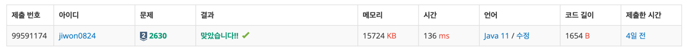

# 요구사항 분석

n*n크기의 색종이가 있음

전체 종이가 모두 같은 색이 아니면 가로와 세로로 중간 부분을 잘라서 4개의 (n/2) * (n/2) 크기의 색종이로 만든다

모든 칸이 파랑/하양 이거나 하나의 정사각형이 될 때까지 자르기 반복

잘라진 하얀색 색종이와 파란색 색종이의 개수 구하기

## 입력

첫줄에 n

다음 줄에 n*n 색종이 상태

## 출력(목표)

첫째 줄에는 잘라진 햐얀색 색종이의 개수

둘째 줄에는 파란색 색종이의 개수

# 왜 코드를 그렇게 짰는지

재귀를 사용해서 4개의 종이로 나누고 모든 색이 같은지 점검을 반복하면 된다.

색종이의 왼쪽 위 점과 오른쪽 아래 점만 알면 4개 색종이의 왼쪽 위 점과 오른쪽 아래 점을 모두 알 수 있음

# 핵심 로직

```java
// 왼쪽 위 좌표(x1, y1) 오른쪽 아래 좌표 (x2, y2)
public static void recur(int x1, int y1, int x2, int y2) {
    // 전체가 같은 색이면 쪼개기 종료
    if (isSame(x1, y1, x2, y2)) {
        if (paper[x1][y1] == 0) white++;
        else blue++;
        return;
    }

    // 재귀 호출 4개로 쪼개기
    recur(x1, y1, (x1 + x2) / 2, (y1 + y2) / 2); // 왼쪽 위
    recur(x1, (y1 + y2) / 2 + 1, (x1 + x2) / 2, y2); // 오른쪽 위
    recur((x1 + x2) / 2 + 1, y1, x2, (y1 + y2) / 2); // 왼쪽 아래
    recur((x1 + x2) / 2 + 1, (y1 + y2) / 2 + 1, x2, y2); // 오른쪽 아래
}
```

# 제출


