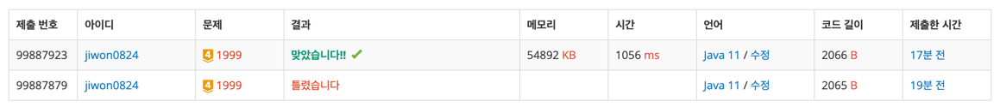

# 요구사항 분석

nxn(1 ≤ N ≤ 250)의 행렬 bxb(1 ≤ B ≤ N)크기의 부분 행렬 중 최대값과 최소값의 차이 구하기

질의는 총 k(1 ≤ K ≤ 100,000)개

## 입력

N, B, K

n\*n행렬

k개의 질의 (i, j)

## 출력(목표)

K개의 줄에, 차례로 각 질문의 답변(부분행렬의 최댓값과 최솟값의 차이값)

# 왜 코드를 그렇게 짰는지

b가 고정이라서 (i, j)~(i, j+b)까지 최대 최소를 구하면,

(i, j)~(i+b, j) b개 중 최대, 최소가 b\*b 행렬의 최대, 최소가 된다.

# 핵심 로직

```java
for (int i = 0; i < n; i++) {
    for (int j = 0; j <= n - b; j++) {
        for (int l = 0; l < b; l++) {
            maxArr[i][j] = Math.max(maxArr[i][j], arr[i][j + l]);
            minArr[i][j] = Math.min(minArr[i][j], arr[i][j + l]);
        }
    }
}

// (중략)

int maxValue = maxArr[x][y];
int minValue = minArr[x][y];

for (int j = 0; j < b; j++) {
    maxValue = Math.max(maxValue, maxArr[x+j][y]);
    minValue = Math.min(minValue, minArr[x+j][y]);
}
System.out.println(maxValue -  minValue);
```

# 제출


