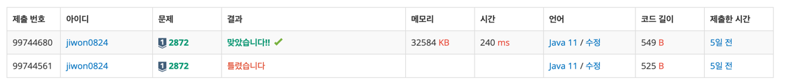

# 요구사항 분석
아무 위치의 책을 뽑을 수 있음. 놓을 때는 제일 위에.

현재 책이 어떻게 쌓여있는지가 주어졌을 때, 몇 번만에 사전 순으로 쌓을 수 있는지 구하기

## 입력
첫째 줄에 책의 개수 N(N ≤ 300,000)

다음 N개 줄에는 가장 위에 있는 책부터 아래에 있는 책까지 순서대로

## 출력(목표)
첫째 줄에 몇 번만에 책을 정렬할 수 있는지 출력

# 왜 코드를 그렇게 짰는지
규칙을 찾기 어려워서 아래 블로그를 보고 규칙을 찾았다. 

[참고 블로그](https://ip99202.github.io/posts/%EB%B0%B1%EC%A4%80-2872-%EC%9A%B0%EB%A6%AC%EC%A7%91%EC%97%94-%EB%8F%84%EC%84%9C%EA%B4%80%EC%9D%B4-%EC%9E%88%EC%96%B4/)

가장 큰 수에서부터 가장 긴 증가하는 부분 수열을 찾는 게 핵심이라고 한다...

그리디는 정말... 어렵다...

# 핵심 로직
```java
int expected = n;
for (int i = n - 1; i >= 0; i--) {
    if (nums[i] == expected) expected--;
}
```
# 제출
