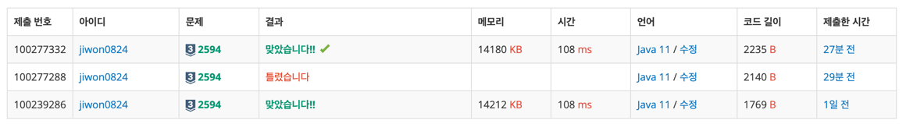

# 요구사항 분석
어떤 놀이기구가 작동을 시작하기 10분 전부터, 모든 놀이기구가 작동을 멈춘 후 10분 후까지는 쉴 수 없고, 그 나머지 일과 시간에만 쉴 수 있다.

하루 일과를 시작하는 시각은 오전 10시이고, 일과를 마치는 시각은 오후 10시

가장 긴 휴식시간이 언제인지

## 입력
놀이기구의 개수 n

n줄: 운행시작시간 운행종료시간

## 출력(목표)
가장 긴 시간을 분 단위로 출력(함께할 수 있는 시간이 없다면 0을 출력)

# 왜 코드를 그렇게 짰는지
사실 boolean 배열을 만들어서 풀려고 했는데, 시간이 없어서 gpt 풀이를 보고 풀었다.

hhmm 형식으로 들어오는 시간을 min으로 바꿔서 가장 긴 시간을 분 단위로 출력

장점은 배열로 하면 10분씩 더하고 최대값이랑 비교해야 하는데, 바로 비교할 수 있음\
단점은 배열보다 조금 더 머리를 써야 하는 거 같음

# 핵심 로직
```java
for (int i = 0; i < n; i++) {
    Ride curr = rides.get(i);

    if(curr.startTime > prevEnd){
        answer = Math.max(answer, curr.startTime-prevEnd);
    }

    // 구간 겹침 방지
    prevEnd = Math.max(prevEnd, curr.endTime);
}
```

# 제출
