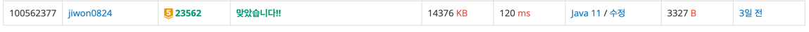

# 요구사항 분석

n x m 격자판이 하나 주어짐.
각 칸은 `#`(검은색) 또는 `.`(흰색).

* 흰 칸을 검게 칠하는 데 드는 비용: `a`
* 검은 칸을 지우고 흰색으로 만드는 비용: `b`

이 격자 어딘가에 크기 k인 ㄷ 모양(정확히는 3k x 3k 영역 안에 그려진 ㄷ)을 하나 만들고,
나머지는 전부 흰색이 되도록 칠하거나 지워야 함.

## 입력
n, m\
a, b\
n줄짜리 보드 상태 (`#` / `.`)

## 출력(목표)

위 조건을 만족하는 상태로 바꾸는 데 드는 최소 비용

---

# 왜 코드를 그렇게 짰는지

처음엔 ㄷ 모양이 살짝 헷갈려서, 패턴을 하드코딩해야 하나 고민했는데,
3k x 3k 정사각형 안에 좌표만 잘 정의하면,
어떤 칸이 검은색이어야 하는지 딱 함수 하나로 판별할 수 있겠다고 생각함.

---

# 핵심 로직

ㄷ 모양 판별 함수 + 해당 위치에 만들 때 비용 계산 + k, 위치 완전 탐색.

```java
// (sx, sy)를 왼쪽 위, 크기 k인 ㄷ 모양에 대해,
// (i, j)가 ㄷ 모양의 검은 칸인지 여부
static boolean isD(int sx, int sy, int k, int i, int j) {
    // 3k x 3k 영역 밖이면 ㄷ에 포함되지 않음
    if (i < sx || i >= sx + 3 * k || j < sy || j >= sy + 3 * k) {
        return false;
    }

    int dx = i - sx;
    int dy = j - sy;

    // 왼쪽 세로줄 전체
    if (dy < k) return true;
    // 위쪽 가로줄 전체
    if (dx < k) return true;
    // 아래쪽 가로줄 전체
    if (dx >= 2 * k) return true;

    // 나머지는 흰색
    return false;
}

// 크기 k, 시작점 (sx, sy)인 ㄷ 모양을 만들기 위한 비용
static long calcCost(int k, int sx, int sy) {
    long cost = 0;

    for (int i = 0; i < n; i++) {
        for (int j = 0; j < m; j++) {
            boolean targetBlack = isD(sx, sy, k, i, j);
            char cur = board[i][j];

            if (cur == '#' && !targetBlack) {
                cost += b;   // 지우기
            } else if (cur == '.' && targetBlack) {
                cost += a;   // 칠하기
            }
        }
    }

    return cost;
}
```

---

# 제출

