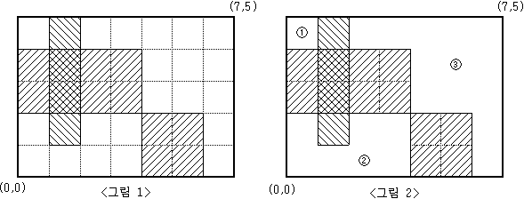

# 요구사항 분석
눈금의 간격이 1인 M×N(M,N≤100)크기의 모눈종이

모눈종이에 K개의 직사각형을 그린다.\
→ K개의 직사각형의 내부를 제외한 나머지 부분이 몇 개의 분리된 영역으로 나누어진다.

M=5, N=7 인 모눈종이 위에 <그림 1>과 같이 직사각형 3개를 그렸다면,\
그 나머지 영역은 <그림 2>와 같이 3개의 분리된 영역으로 나누어지게 된다.\
분리된 세 영역의 넓이는 각각 1, 7, 13


모눈종이의 크기와 k개의 직사각형 좌표가 주어질 때,\
몇 개의 분리된 영역으로 나누어지는지, 그리고 분리된 각 영역의 넓이가 얼마인지를 구하여 이를 출력
## 입력
첫째 줄에 M과 N, 그리고 K가 빈칸을 사이에 두고 차례로 주어진다. (1 <= M, N, K <= 100)

둘째 줄부터 K개의 줄에는 한 줄에 하나씩 직사각형의 왼쪽 아래 꼭짓점의 x, y좌표값과 오른쪽 위 꼭짓점의 x, y좌표값이 빈칸을 사이에 두고 차례로 주어진다.

모눈종이의 왼쪽 아래 꼭짓점의 좌표는 (0,0)이고, 오른쪽 위 꼭짓점의 좌표는(N,M)이다.
입력되는 K개의 직사각형들이 모눈종이 전체를 채우는 경우는 없다.

## 출력(목표)
첫째 줄에 분리되어 나누어지는 영역의 개수를 출력\
둘째 줄에는 각 영역의 넓이를 오름차순으로 정렬하여 빈칸을 사이에 두고 출력
# 왜 코드를 그렇게 짰는지
k개의 직사각형의 좌표를 받아서, arr에 for문 돌면서 체크

for문을 돌면서 0인 구역을 만나면 해당 구역의 갯수를 세기 위해 dfs를 돈다.\
영역 1개를 만난 상황이므로 cnt++;\
dfs로 0인 구역 하나씩 돌면서 영역 갯수 세기(dfs 재귀호출할 때마다 전역변수 area+1)\
dfs가 끝나면, 구한 영역의 크기 area를 areas List에 넣어준다.
# 핵심 로직
dfs는 다른 문제들과 동일. 재귀호출 전에 area++;만 추가해주면, 해당 구역의 크기를 구할 수 있음
```java
// [solution] dfs로 0인 구역 하나씩 돌면서 영역 갯수 세기
for (int i = 0; i < n; i++) {
    for (int j = 0; j < m; j++) {
        if (visited[i][j] || arr[i][j] == 1) continue;

        visited[i][j] = true; // 방문 체크
        cnt++; // 영역 1개 추가

        area = 1; // 영역 크기 1로 초기화
        dfs(i, j); // 영역 전부 돌기

        areas.add(area);
    }
}

// [output] 첫째 줄에 분리되어 나누어지는 영역의 개수를 출력
System.out.println(cnt);
// [output] 둘째 줄에는 각 영역의 넓이를 오름차순으로 정렬하여 빈칸을 사이에 두고 출력
areas.sort((e1, e2) -> e1 - e2);
for (Integer e : areas) {
    System.out.print(e + " ");
}
```