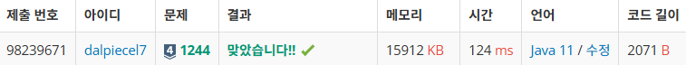

# 요구사항 분석
1. 남학생
   - 스위치의 번호가 자기가 받은 수의 배수이면, 그 스위치의 상태를 바꿈
   - 받은 수가 3 -> 3, 6 스위치의 상태를 바꿔줌
2. 여학생
   - 받은 수와 같은 번호가 붙은 스위치를 중심으로 좌우가 대칭 + 가장 많은 스위치를 포함하도록
   - ex -> 12'3'45 인줄 알았지만?
   - +) 양쪽의 스위치의 상태도 같아야함!!

## 입력
첫째 줄에는 스위치 개수가 주어진다.
스위치 개수는 100 이하인 양의 정수이다.
둘째 줄에는 각 스위치의 상태가 주어진다.
켜져 있으면 1, 꺼져있으면 0이라고 표시하고 사이에 빈칸이 하나씩 있다.
셋째 줄에는 학생수가 주어진다. 학생수는 100 이하인 양의 정수이다.
넷째 줄부터 마지막 줄까지 한 줄에 한 학생의 성별, 학생이 받은 수가 주어진다.
남학생은 1로, 여학생은 2로 표시하고, 학생이 받은 수는 스위치 개수 이하인 양의 정수이다.
학생의 성별과 받은 수 사이에 빈칸이 하나씩 있다.

## 출력(목표)
스위치의 상태를 1번 스위치에서 시작하여 마지막 스위치까지 한 줄에 20개씩 출력한다.
예를 들어 21번 스위치가 있다면 이 스위치의 상태는 둘째 줄 맨 앞에 출력한다.
켜진 스위치는 1, 꺼진 스위치는 0으로 표시하고, 스위치 상태 사이에 빈칸을 하나씩 둔다.

# 왜 코드를 그렇게 짰는지
- 스위치의 상태를 바꾸는 부분을 `switches[num-1] = (switches[num-1] + 1) % 2;`
  - if 문을 사용해서 0 -> 1, 1 -> 0 으로 하면 비효율적이라고 생각함
  - 스위치의 상태는 0, 1 이기때문에 +1하고 2로 나눈 나머지를 구하면 현재 상태의 반대가 됨
- 남학생의 스위치 상태를 변하게 할 때 while 문을 사용함
  - for 문을 쓰고 싶었는데, 범위를 어떻게 정해야 할지 생각이 안남 -> while 문 사용

# 핵심 로직
1. 남학생의 스위치 상태를 변경하는 부분
```declarative
    if (gender == 1){
        int num = number;
        // number의 배수인 스위치의 상태를 변경함
        while (num <= N){
            switches[num-1] = (switches[num-1] + 1) % 2;
            num += number;
        }
    }
```

2. 여학생의 스위치를 변경할 때 범위를 정하는 부분
```declarative
    int left = number - 1;
    int right = number - 1;
    
    while (left - 1 >= 0 && right+1 < N && switches[left - 1] == switches[right + 1]) {
        left--;
        right++;
    }
    
    for (int i = left; i <= right; i++) {
        switches[i] = (switches[i] + 1) % 2;
    }
```

# 제출
