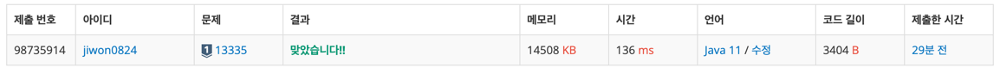

# 요구사항 분석
강 위에 다리를 n개의 트럭이 지나가려고 함

트럭의 순서는 고정(바꿀 수 x)

- 다리 위에는 w대의 트럭만 올라갈 수 있음(다리 길이가 w라서)
- 동시에 다리 위에 올라가 있는 트럭들의 무게의 합은 다리의 최대하중인 L보다 작거나 같아야 한다.
- 다리 위에 완전히 올라가지 못한 트럭의 무게는 다리 위의 트럭들의 무게의 합을 계산할 때 포함하지 않는다

트럭은 1만큼의 시간에 1만큼만 움직일 수 있음

모든 트럭이 다리를 건너는 최단시간을 구하는 프로그램

## 입력
첫 번째 줄에는 세 개의 정수 ① 트럭의 수 n (1 ≤ n ≤ 1,000) , ② 다리의 길이 w (1 ≤ w ≤ 100) ③ 다리의 최대하중 L (10 ≤ L ≤ 1,000)

두 번째 줄에는 n개의 정수 a1, a2, ⋯ , an (1 ≤ ai ≤ 10)가 주어지는데, ai는 i번째 트럭의 무게

## 출력(목표)
모든 트럭들이 다리를 건너는 최단시간을 출력

# 왜 코드를 그렇게 짰는지
다리가 하나의 Queue라고 볼 수 있음

먼저 들어온 트럭이 먼저 나간다.

1. Queue에 들어온 원소의 개수, 총 무게를 확인하면서 다음 원소를 넣을지 말지 결정
2. 다리 길이보다 시간이 적으면 Queue의 모든 원소(객체)에 대해 시간을 1 더해서 다시 넣어주는 작업

# 핵심 로직
idx<n까지만 했다가 마지막 트럭의 시간을 계산하지 못해서 계속 틀렸었다.

1. idx<n 이거나 queue(다리)가 비어있지 않으면 계속 반복해야 함.
   - 다리 위에 있는 트럭들을 한 칸씩 움직이면서 다리 길이 시간만큼 움직인 친구들은 제거해준다.
   - 그렇지 않은 애들은 시간을 1 늘려서 queue에 추가해준다.
2. 조건에 맞으면 새 트럭을 다리에 추가해줘야 한다.
   - idx가 n미만 이어야 함
   - 다리 위에 있는 트럭 수(queue.size())가 다리 길이보다 작아야 함.
   - 다리 위 무게에 현재 트럭 무게를 더했을 때 최대 하중 이하여야 함

```java
public static int simulation() {
        Queue<Truck> queue = new ArrayDeque<>();

        int time = 0; // 총 걸린 시간
        int idx = 0; // 현재 Queue에 들어가고 싶은 트럭의 Idx
        int sumOfTruckWeight = 0;

        while (idx < n || !queue.isEmpty()) {
            // 트럭 한 칸씩 움직이기
            // Queue에 있는 트럭들을 하나씩 빼가면서 time하나씩 추가
            int size = queue.size();
            while (size-- > 0) {
                Truck curr = queue.poll();
                // 다리 끝에 있는 트럭은 꺼내 준다
                if (curr.time == w) {
                    // 현재 트럭의 무게 만큼 다리 위 트럭 무게 함이 줄어듦
                    sumOfTruckWeight -= curr.weight;
                } else {
                    // 그게 아닌 트럭은 time 1더해서 뒤에 넣어주기
                    curr.time++;
                    queue.offer(curr);
                }
            }

            // 트럭을 Queue(다리)에 넣기 위한 조건
            // 현재 트럭 + 다리 위에 있는 트럭의 수가 다리 길이 보다 작거나 같아야 함
            // 현재 트럭 무게 + 다리 위에 있는 트럭의 총 무게 합이 l보다 작거나 같아야 함
            if (idx < n && queue.size() < w && sumOfTruckWeight + trucks[idx] <= l) {
                // idx 번째 트럭을 다리 위에 올리고, 트럭 무게 합 증가
                queue.offer(new Truck(trucks[idx], 1));
                sumOfTruckWeight += trucks[idx++];
            }

            time++;
        }

        return time;
    }
```

# 제출
