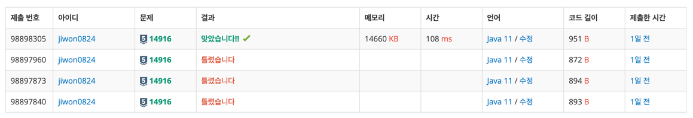

# 요구사항 분석
손님이 2원짜리와 5원짜리로만 거스름돈을 달라고 한다.

우리는 2원짜리 동전과 5원짜리 동전은 무한정 많이 가지고 있다.

거스름돈이 n인 경우, 최소 동전의 개수가 몇 개인지 알려주는 프로그램
## 입력
첫째 줄에 거스름돈 액수 n(1 ≤ n ≤ 100,000)
## 출력(목표)
거스름돈 동전의 최소 개수를 출력(거슬러 줄 수 없으면 -1을 출력)

# 왜 코드를 그렇게 짰는지
많이 나오는 기본 그리디, dp문제.

그리디로 푸는 방법이 기억 안 나서 dp로 풀었다.

2원을 더하는 경우와 5원을 더하는 경우를 나누어서 풀었다.
# 핵심 로직
```java
dp = new int[n + 1];
for (int i = 0; i <= n; i++) dp[i] = -1;

dp[0] = 0; // 0원을 만들기 위해 필요한 동전 수는 0
for (int i = 1; i <= n; i++) {
    if (i - 2 >= 0 && dp[i - 2] != -1) {
        if (dp[i] == -1 || dp[i] > dp[i - 2] + 1) {
            dp[i] = dp[i - 2] + 1;
        }
    }
    if (i - 5 >= 0 && dp[i - 5] != -1) {
        if (dp[i] == -1 || dp[i] > dp[i - 5] + 1) {
            dp[i] = dp[i - 5] + 1;
        }
    }
}
```
# 제출
