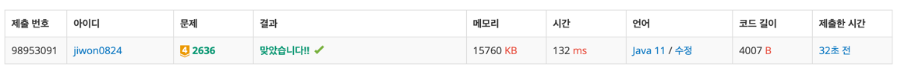

# 요구사항 분석
N*M 크기의 격자에 치즈 정보가 주어진다(0: 치즈 없음, 1: 치즈 있음)

테두리의 치즈는 1시간이 지나면 녹는다(치즈에 둘러쌓인 치즈 구멍 근처 치즈는 녹지 않는다).

모두 녹아 없어지는 데에 걸리는 시간 && 전부 녹기 한 시간 전에 남아있는 치즈칸 개수
## 입력
첫째 줄 n, m(격자의 가로, 세로 길이)
둘째 줄~ 격자 정보. 치즈 없는 칸: 0, 치즈 있는 칸:1

## 출력(목표)
첫째 줄 치즈가 모두 녹아서 없어지는 데 걸리는 시간

둘째 줄 모두 녹기 한 시간 전에 남아있는 치즈조각이 놓여 있는 칸의 개수
# 왜 코드를 그렇게 짰는지
## bfs탐색하면서 라벨링을 하면 어떨까?

1에서 bfs를 시작하는 게 아니라 반대로 0 부분을 라벨링한다고 생각해보자 → 그러면 치즈로 둘러쌓인 부분은 재탐색해야겠지?

흠 근데 굳이 라벨링까지 안해도 될 거 같음. 테두리 치즈만 알면 되는 거라서 라벨링하면 괜히 더 어려워질 거 같다.

바깥에서 탐색을 시작해서, 처음 만나는 치즈가 테두리 치즈

테두리 치즈는 전부 List에 넣은 다음, 한 번에 0으로 바꿔주고

다시 완탐해서 테두리 치즈 체크


> 계획을 세우다가 든 생각은 주변 치즈 개수를 세서 3개 이상인 치즈는 안 녹나?\
→ 반례가 있음

## 그러면 어떻게 치즈가 다음에 녹는지 아닌지 알 수 있지?
테두리 치즈를 찾을 때(0에서부터 bfs 시작할 때) 테두리 치즈까지 visited 체크\
치즈(1)에서 bfs를 돌려서 visited 체크를 해보자. 만약에 치즈 전체가 visited 체크가 되어 있으면 치즈는 다음 시간에 모두 녹게 됨

근데 사실 이것도 필요없을 거 같아.

> 마지막 치즈칸 개수를 저장하는 변수 하나 있으면 될 거 같음
> 
> 녹일 치즈가 하나도 없으면 시간과 마지막 치즈 칸 개수를 출력해주면 될 듯?

# 핵심 로직
1. 0인 바깥구역을 모두 탐색하면서 테두리 치즈를 만나면, Set에 좌표를 추가(Set이 비어있으면 null return)해준다.
2. 반환값이 null이면 반복 종료
3. Set에 들어있는 좌표들을 0으로 바꿔준다.
4. Set에 들어있는 좌표의 개수만큼 남아있는 치즈 개수를 빼준다.
```java
// 시간을 하나씩 늘려가면서
while (true) {
    // 녹일 거 찾은 다음 없으면 끝내기(bfs)
    Set<Coord> toMelt = getEdgeCheese(0, 0);
    if (toMelt == null) {
        break;
    }

    // 녹이고 1시간 증가
    melt(toMelt);
    time++;
    // 테두리 치즈 개수만큼 제거
    if (remainCheese > toMelt.size()) remainCheese -= toMelt.size();
}
```
# 제출

# 배운 것
아래와 같이 코드를 작성했었는데, Set에 중복된 좌표(객체)가 들어갔다.

HashSet은 내부적으로 equals와 hashCode가 구현되어 있어야 작동한다고 한다.

[10. [자바] HashSet이 중복값을 제거하지 못할 때 - 개발일기
](https://staticclass.tistory.com/105)
```java
package Sep_25.week04.박지원;

import java.io.BufferedReader;
import java.io.IOException;
import java.io.InputStreamReader;
import java.util.*;

public class boj_2636 {
    public static class Coord{
        int x;
        int y;

        public Coord(int x, int y) {
            this.x = x;
            this.y = y;
        }
    }

    public static int[] dx = {0, 0, 1, -1};
    public static int[] dy = {1, -1, 0, 0};

    public static int n, m;
    public static int[][] arr;

    public static int remainCheese, time;

    public static void main(String[] args) throws IOException {
        // 첫째 줄에는 사각형 모양 판의 세로와 가로의 길이가 양의 정수로 주어진다. 세로와 가로의 길이는 최대 100이다.
        BufferedReader br = new BufferedReader(new InputStreamReader(System.in));
        // 판의 각 가로줄의 모양이 윗 줄부터 차례로 둘째 줄부터 마지막 줄까지 주어진다.
        // 치즈가 없는 칸은 0, 치즈가 있는 칸은 1로 주어지며 각 숫자 사이에는 빈칸이 하나씩 있다.
        StringTokenizer st = new StringTokenizer(br.readLine());
        n = Integer.parseInt(st.nextToken());
        m = Integer.parseInt(st.nextToken());

        arr = new int[n][m];
        for (int i = 0; i < n; i++) {
            st = new StringTokenizer(br.readLine());
            for (int j = 0; j < m; j++) {
                arr[i][j] = Integer.parseInt(st.nextToken());

                // 총 치즈 개수 세기
                if(arr[i][j]==1) remainCheese++;
            }
        }

        // 시간을 하나씩 늘려가면서
        while(true){
            System.out.println(remainCheese);
            // 녹일 거 찾은 다음 없으면 끝내기
            Set<Coord> toMelt = getEdgeCheese(0, 0);
            if(toMelt == null){
                break;
            }

            // 녹이고 1시간 증가
            melt(toMelt);
            time++;
            // 테두리 치즈 개수만큼 제거
            remainCheese-=toMelt.size();
        }

        System.out.println(STR."\{time} \{remainCheese}");
    }

    // 녹일 치즈의 리스트 만들기
    public static Set<Coord> getEdgeCheese(int startX, int startY){
        Set<Coord> edgeCoord = new HashSet<>();
        Queue<Coord> queue = new ArrayDeque<>();
        boolean[][] visited = new boolean[n][m];

        queue.offer(new Coord(startX, startY));
        visited[startX][startY] = true;

        while(!queue.isEmpty()){

            Coord curr = queue.poll();

            for (int dir = 0; dir < 4; dir++) {
                int nx = curr.x + dx[dir];
                int ny = curr.y + dy[dir];

                // 배열 범위 밖이거나 방문한 곳은 건너뛰기
                if(nx<0 || nx>=n || ny<0 ||ny>=m) continue;
                if (visited[nx][ny]) continue;

                // 치즈는 리스트에 넣고 건너뛰기(탐색x)
                // set이므로 중복 좌표는 들어가지 않는다
                if(arr[nx][ny] == 1){
                    edgeCoord.add(new Coord(nx, ny));
                }
                // 치즈 없는 곳이면 다른 테두리 치즈를 찾아 떠나자
                else if(arr[nx][ny]==0){
                    queue.offer(new Coord(nx, ny));
                    visited[nx][ny] = true;
                }
            }
        }

        if(edgeCoord.isEmpty()) return null;
        else return edgeCoord;
    }

    // 치즈 녹이기
    public static void melt(Set<Coord> toMelt){
        for (Coord coord : toMelt) {
            arr[coord.x][coord.y] = 0;
        }
    }
}
```