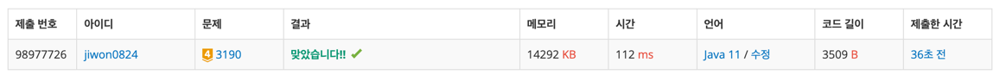

# 요구사항 분석
게임은 NxN 정사각 보드위에서 진행

보드의 상하좌우 끝에 벽

게임이 시작할때 뱀은 맨위 맨좌측(1, 1)에 위치, 뱀의 길이는 1, 방향은 오른쪽을 향한다.

- 벽이나 몸에 부딪히면 게임 끝
- 머리 이동
  - 사과 먹으면 꼬리 이동x(몸 길이 1증가)
  - 사과 안 먹으면 꼬리 이동

사과의 위치와 뱀의 이동경로가 주어질 때 이 게임이 몇 초에 끝나는지 계산
## 입력
첫째 줄에 보드의 크기 N(2 ≤ N ≤ 100)

다음 줄에 사과의 개수 K(0 ≤ K ≤ 100)

다음 K개의 줄에는 사과의 위치(열 행)

다음 줄에는 뱀의 방향 변환 횟수 L(1 ≤ L ≤ 100)

다음 L개의 줄에는 뱀의 방향 변환 정보
- 정수 X와 문자 C
- 게임 시작 시간으로부터 X초가 끝난 뒤에 왼쪽(C가 'L') 또는 오른쪽(C가 'D')로 90도 방향을 회전시킨다는 뜻
- X는 10,000 이하의 양의 정수이며, 방향 전환 정보는 X가 증가하는 순으로 주어진다.
## 출력(목표)
첫째 줄에 게임이 몇 초에 끝나는지 출력

# 왜 코드를 그렇게 짰는지
queue / deque를 쓰는 문제라고 분류에 적혀 있음

시작 머리 좌표를 넣어주고, 머리 좌표를 queue에서 꺼내지 "않고" 가져온다.\
이동할 좌표를 구해준 다음 뱀이 죽는지 아닌지 구해준다.\
죽지 않으면 다음 좌표가 사과인지 아닌지에 따라 동작을 진행한다.
- 사과인 경우
  - 이동할 좌표를 뱀 좌표라고 표시해주고, deque의 앞에 넣어준다.
- 사과가 아닌 경우
  - 몸 길이를 다시 줄여줘야 하므로 머리를 넣어주고 `offerFirst()`
  - 꼬리를 삭제한다 `removeLast()`


# 핵심 로직
1. 머리 좌표를 가져온다
2. 사망 판단
3. 사과/그냥 땅에 따라 처리
```java
private static void move() {
    // 머리 한 칸 전진
    Coord currHead = snake.getFirst();
    int nx = currHead.x + dx[currDir];
    int ny = currHead.y + dy[currDir];

    // 만약에 몸이나 벽에 부딪히면 alive false로 바꾸고 return 해주기
    if(nx<0 || nx>=n ||ny <0 || ny>=n || map[nx][ny]==2){
        alive= false;
        return;
    }

    // 해당 좌표가 사과인 경우
    if(map[nx][ny]==1){
        map[nx][ny] = 2;
        snake.offerFirst(new Coord(nx, ny)); // 새 머리 달아주기
    }else if(map[nx][ny]==0){
        map[nx][ny] = 2; // 머리 부분 좌표를 2로
        snake.offerFirst(new Coord(nx, ny));

        Coord tail = snake.removeLast();
        map[tail.x][tail.y] = 0;// 꼬리 부분 좌표를 0으로 만들어주기-
    }
}
```
# 제출
