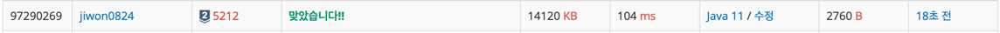

# 요구사항 분석
다도해의 지도는 R*C 크기의 그리드로 나타낼 수 있다('X'는 땅, '.'는 바다)\
인접한 세 칸 또는 네 칸에 바다가 있는 땅은 모두 잠겨버린다\
지도의 크기는 모든 섬을 포함하는 가장 작은 직사각형이다.\
50년이 지난 후에도 섬은 적어도 한 개 있다. \
**또, 지도에 없는 곳, 지도의 범위를 벗어나는 칸은 모두 바다이다.** <- 여기가 핵심
## 입력
첫째 줄에 지도의 크기 R과 C (1 ≤ R, C ≤ 10)가 주어진다.\
다음 R개 줄에는 현재 지도가 주어진다.
## 출력(목표)
50년 후의 지도를 출력
# 왜 코드를 그렇게 짰는지
거북이 문제랑 비슷하면서도 조금 다름\
이 문제의 포인트는 4방향 탐색해서 바다에 잠기는 섬을 찾아내야한다.\
그리고 섬의 개수에 맞게 지도의 개수가 줄어들기 때문에, minX, minY, maxX, maxY를 구해야 한다.\
구한 지점을 기준으로 주변 바다 갯수가 2이하인 지점을 출력하면 된다.

# 핵심 로직
numOfOcean 배열에 주변에 바다 갯수를 세서 담음. 담을 때 배열 범위를 벗어나면 바다로 취급.\
주변 바다 갯수가 2개 이하면 50년 후에도 살아남는 섬이라는 의미이므로 minX, maxX, minY, maxY 갱신\
갱신한 지점을 기준으로 새 지도 출력

# 제출
