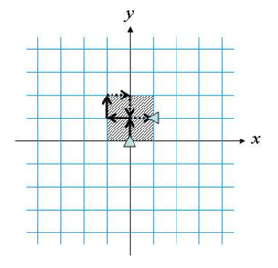
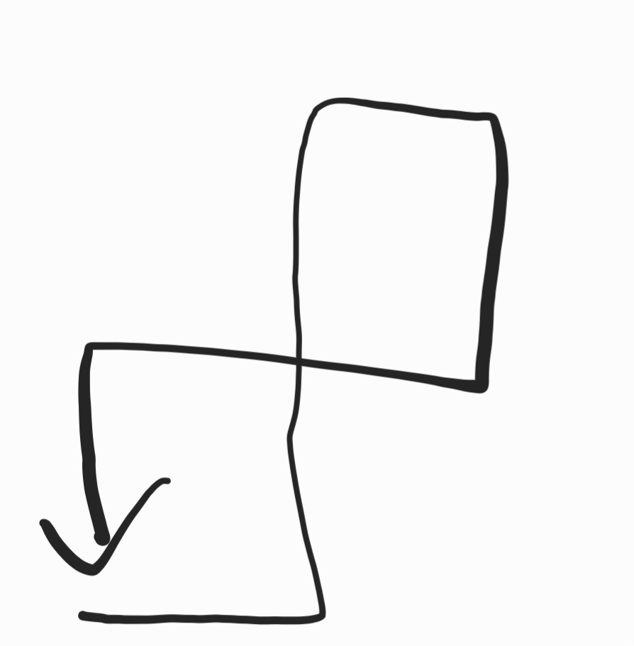
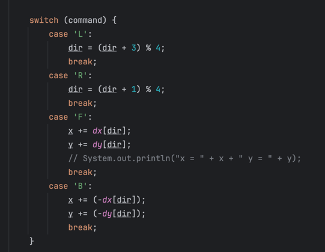

# 요구사항 분석
## 입력
```
T: 테스트 케이스의 수
move: 컨트롤 프로그램(네가지 명령으로만 이루어져 있고, 길이는 500을 넘지 않는다)
```
## 출력(문제의 목표)
거북이가 이동한 영역을 모두 포함하는 가장 작은 직사각형의 넓이를 출력
# 왜 코드를 그렇게 작성했는지
문제에서 FLFRFLBRBLB인 경우, 아래와 같이 움직이고, 사각형이 칠해진다고 적혀있다.
(최대x-최소x) * (최대y-최소y)를 해주면 거북이가 이동한 영역을 모두 포함하는 가장 작은 직사각형의 넓이를 구할 수 있다. 


## 어려웠던 점
직선일 경우 넓이가 0이라는 걸 보고, 쫄아서 문제를 잘 안 읽음. 문제를 어렵게 생각해서 아래와 같은 경우는 어떻게 처리하지? 고민함


# 핵심 로직
dx, dy를 이용해서 최대, 최소 x, y를 구하고, 이를 바탕으로 width, height를 계산하여, 곱해주면 된다.\
dx, dy 순서를 잘 정의해서 왼쪽, 오른쪽 회전을 +와 %연산으로 구현하는 부분이 포인트인 것 같다.

# 채점
