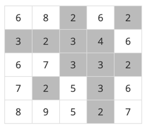
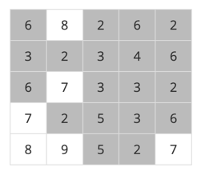

# 요구사항 분석
어떤 지역의 높이 정보를 파악한다. 그 다음에 그 지역에 많은 비가 내렸을 때 물에 잠기지 않는 안전한 영역이 최대로 몇 개가 만들어 지는 지를 조사

문제를 간단하게 하기 위하여, 장마철에 내리는 비의 양에 따라 일정한 높이 이하의 모든 지점은 물에 잠긴다고 가정

물에 잠기지 않는 안전한 영역이라 함은 물에 잠기지 않는 지점들이 위, 아래, 오른쪽 혹은 왼쪽으로 인접해 있으며 그 크기가 최대인 영역

**아무 지역도 물에 잠기지 않을 수도 있다.**

\
비가 높이 4만큼 내려서 안전지대가 5개가 된 경우

\
비가 높이 6만큼 내려서 안전지대가 4개가 된 경우

## 입력
첫째 줄에는 어떤 지역을 나타내는 2차원 배열의 행과 열의 개수를 나타내는 수 N이 입력된다.(2 <= N <= 100)

둘째 줄부터 N개의 각 줄에는 2차원 배열의 첫 번째 행부터 N번째 행까지 순서대로 한 행씩 높이 정보 h가 입력된다.

각 줄에는 각 행의 첫 번째 열부터 N번째 열까지 N개의 높이 정보 h를 나타내는 자연수가 빈 칸을 사이에 두고 입력된다.(1 <= h <= 100)
## 출력(목표)
첫째 줄에 장마철에 물에 잠기지 않는 안전한 영역의 최대 개수를 출력
# 왜 코드를 그렇게 짰는지
높이는 0부터 시작, 최대 100까지 있으므로 `h=0; h<=100; h++`라고 작성했다.
- 아무 지역도 물에 잠기지 않을 수도 있다. (높이 0부터 시작)

그리고 모든 칸에 대해 그 높이보다 높은 칸만 상하좌우로 dfs(이 문제는 bfs로 풀어도 동일할 거 같음)를 진행한다.
- 물에 잠기지 않는 안전한 영역이라 함은 물에 잠기지 않는 지점들이 위, 아래, 오른쪽 혹은 왼쪽으로 인접해 있으며 그 크기가 최대인 영역

dfs를 진행할 때마다 안전구역의 갯수를 1씩 증가시킨다.
- 한 칸에서 시작해서 그 칸과 연결된 지역이 하나의 안전구역이니까
- 그 칸과 연결된 안전구역이 아닌 구역을 탐색할 때는 구역의 갯수를 하나 증가시킨다.

# 핵심 로직
dfs 자체는 다른 문제들이랑 동일하게 진행되는데, 문제를 읽고 높이를 몇부터 몇까지 반복해야 하는지 알아내는 게 이 문제의 포인트인 거 같다.\
나는 그냥 0부터 100까지 모두 탐색하도록 코드를 작성했는데, 배열을 입력받을 때 건물의 최대 높이를 저장하는 maxHeight 변수를 만든 다음, 0부터 maxHeight까지 반복하면 불필요한 연산을 줄일 수 있다.
```java
// 높이는 1이상 100 이하의 정수 + 비가 오지 않는 경우0
for (int h = 0; h <= 100; h++) {
    visited = new boolean[n+1][n+1];
    int safeCnt = 0;
    for (int i = 0; i < n; i++) {
        for (int j = 0; j < n; j++) {
            if(!visited[i][j] && map[i][j]>h){
                safeCnt++;

                visited[i][j] = true;
                dfs(i, j, h);
            }
        }
    }
    maxSafe = Math.max(maxSafe, safeCnt);
}

System.out.println(maxSafe);
```