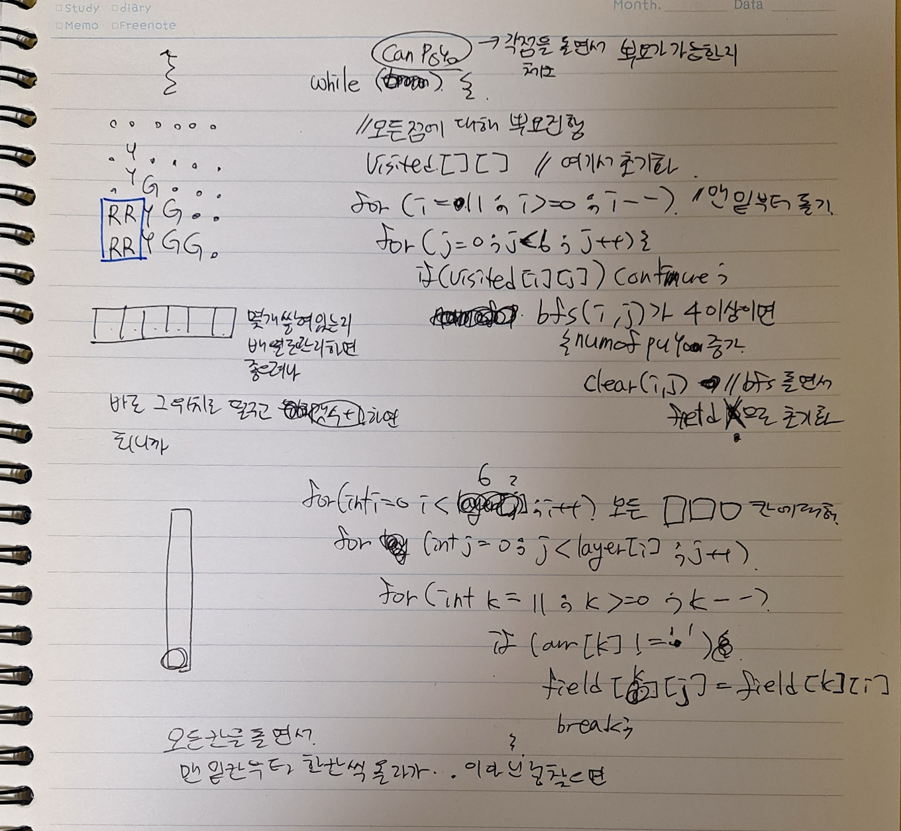

# 요구사항 분석
같은 색 뿌요가 4개 이상 상하좌우로 연결되어 있으면 연결된 같은 색 뿌요들이 한꺼번에 없어진다. 이때 1연쇄가 시작된다.

뿌요들이 없어지고 나서 위에 다른 뿌요들이 있다면, 중력의 영향을 받아 차례대로 아래로 떨어지게 된다.

아래로 떨어지고 나서 다시 같은 색의 뿌요들이 4개 이상 모이게 되면 또 터지게 되는데, 터진 후 뿌요들이 내려오고 다시 터짐을 반복할 때마다 1연쇄씩 늘어난다.

**터질 수 있는 뿌요가 여러 그룹이 있다면 동시에 터져야 하고 여러 그룹이 터지더라도 한번의 연쇄가 추가된다.**

상대방의 필드가 주어졌을 때, 연쇄가 몇 번 연속으로 일어날지 계산하여 출력
## 입력
총 12개의 줄에 필드의 정보가 주어지며, 각 줄에는 6개의 문자가 있다.
- .은 빈공간이고 .이 아닌것은 각각의 색깔의 뿌요
    - R은 빨강, G는 초록, B는 파랑, P는 보라, Y는 노랑

입력으로 주어지는 필드는 뿌요들이 전부 아래로 떨어진 뒤의 상태이다. 즉, 뿌요 아래에 빈 칸이 있는 경우는 없다.

## 출력(목표)
현재 주어진 상황에서 몇연쇄가 되는지 출력\
하나도 터지지 않는다면 0을 출력
# 왜 코드를 그렇게 짰는지
고민 흔적

아래줄부터 돌리면서 뿌요가 가능한지 검사(아래부터 터져서 밑으로 떨어지니까)

뿌요가 가능하다면 터트린 후, shift → 다시 왼쪽 아래부터 검사해야 함

다 돌았는데, 뿌요가 불가능하다면 연쇄 몇 번 했는지 출력

그러면 필요한 기능은 다음과 같다.
1. bfs를 해서 같은 색 뿌요가 몇 개인지 알아내야 함(4개 이상이라면 해당 좌표를 지워야 하니까 좌표를 반환하면 좋겠다는 생각이 들어서 List<Coord>를 반환하도록 함수 설계)
2. 4개 이상일 때 field arr를 지우는 함수
3. field를 중력 적용 받도록 아래로 떨어트리는 함수
+ 나는 여기에 있으면 편할 거 같아서 inRange함수와 디버깅용 printField 함수를 만들었다.

# 핵심 로직
`getPuyoCoord()`에서 bfs로 근처에 같은 색 뿌요의 좌표를 List에 담아서 반환한다.\
List의 크기(=같은 색 뿌요의 갯수)가 4이상이면, 삭제할 좌표 리스트`toClear`에 모아놨다가 삭제한다.
toClear()가 빈리스트라면, 터지는 뿌요가 없다는 의미이므로, while 반복을 종료하고, 몇 번의 연쇄가 일어나는지 출력한다.
```java
// [solution] 뿌요가 가능하면 가능한 거 다 터트리고 중력 적용 반복
while (true) {
    visited = new boolean[12][6];
    List<Coord> toClear = new ArrayList<>();
    for (int i = 11; i >= 0; i--) {
        for (int j = 0; j < 6; j++) {
            // 방문한 칸이면 방문하지 않음 || 뿌요가 없는 칸은 방문하지 않음
            if (visited[i][j] || field[i][j] == '.') continue;

            List<Coord> coords = getPuyoCoord(i, j);
            if (coords.size() >= 4) {
                toClear.addAll(coords);
            }
        }
    }

    // 터지는 게 없으면 반복 종료
    if(toClear.isEmpty()) break;

    numOfChain++; // 4개 이상이면 1연쇄
    clearField(toClear);
    // 뿌요 되는 거 다 터트렸으면 전부 아래로 내려줌
    moveDown();
}

// [output] 총 연쇄 횟수
System.out.println(numOfChain);
```
## + 틀렸습니다(1)
### 틀린 코드 핵심부
`canPuyo()`함수를 만들어서 1개라도 터트릴 수 있으면 반복하도록 했었다. 문제를 잘못 이해해서 1개를 터트릴 때마다 `numOfChain++; // 4개 이상이면 1연쇄`를 해줬었다.\
그런데 가능한 터트림을 모두 하고, 한 번 내려오는 게 1연쇄여서 수정이 필요했음.\
또한 canPuyo()가 main 함수의 뿌요를 터트리는 부분과 코드가 중복되어서 좋지 않은 코드였다.

⇒ `while(true)`로 변경 후, 터트릴 좌표를 모아서 처리해줬다. 터트릴 좌표가 없으면 더이상 연쇄가 일어나지 않는 것이므로 반복을 종료하도록 했다.
```java
while (canPuyo()) {
    visited = new boolean[12][6];
    for (int i = 11; i >= 0; i--) {
        for (int j = 0; j < 6; j++) {
            // 방문한 칸이면 방문하지 않음 || 뿌요가 없는 칸은 방문하지 않음
            if (visited[i][j] || field[i][j] == '.') continue;

            List<Coord> coords = getPuyoCoord(i, j);
            if (coords.size() >= 4) {
                numOfChain++; // 4개 이상이면 1연쇄
                clearField(coords);
//                        System.out.println("============[clear]===========");
//                        printField();
            }
        }
    }

    // 뿌요 되는 거 다 터트렸으면 전부 아래로 내려줌
    moveDown();

//            System.out.println("============[movedown]============");
//            printField();
}
```

### 전체 코드(오답 코드)
```java
import java.io.BufferedReader;
import java.io.IOException;
import java.io.InputStreamReader;
import java.util.ArrayDeque;
import java.util.ArrayList;
import java.util.List;
import java.util.Queue;

public class Main {

    public static class Coord {
        int x;
        int y;

        public Coord(int x, int y) {
            this.x = x;
            this.y = y;
        }
    }

    public static int[] dx = {0, 0, 1, -1};
    public static int[] dy = {1, -1, 0, 0};


    public static int numOfChain; // [goal] 총 연쇄 횟수

    public static char[][] field; // 필드 정보
    public static boolean[][] visited;

    public static void main(String[] args) throws IOException {
        BufferedReader br = new BufferedReader(new InputStreamReader(System.in));

        field = new char[12][6];

        // [input] 총 12개의 줄에 필드의 정보가 주어지며, 각 줄에는 6개의 문자가 있다.
        //이때 .은 빈공간이고 .이 아닌것은 각각의 색깔의 뿌요를 나타낸다.
        //R은 빨강, G는 초록, B는 파랑, P는 보라, Y는 노랑이다.
        for (int i = 0; i < 12; i++) {
            String line = br.readLine();
            for (int j = 0; j < 6; j++) {
                field[i][j] = line.charAt(j);
                //입력으로 주어지는 필드는 뿌요들이 전부 아래로 떨어진 뒤의 상태이다. 즉, 뿌요 아래에 빈 칸이 있는 경우는 없다.
            }
        }

        // [solution] 뿌요가 가능하면 가능한 거 다 터트리고 중력 적용 반복
        while (canPuyo()) {
            visited = new boolean[12][6];
            for (int i = 11; i > 0; i--) {
                for (int j = 0; j < 6; j++) {
                    // 방문한 칸이면 방문하지 않음 || 뿌요가 없는 칸은 방문하지 않음
                    if (visited[i][j] || field[i][j] == '.') continue;

                    List<Coord> coords = getPuyoCoord(i, j);
                    if (coords.size() >= 4) {
                        numOfChain++; // 4개 이상이면 1연쇄
                        clearField(coords);
//                        System.out.println("============[clear]===========");
//                        printField();
                    }
                }
            }

            // 뿌요 되는 거 다 터트렸으면 전부 아래로 내려줌
            moveDown();

//            System.out.println("============[movedown]============");
//            printField();
        }

        // [output] 총 연쇄 횟수
        System.out.println(numOfChain);
    }

    // 필드 깨끗하게 비우기
    private static void clearField(List<Coord> coords) {
        for (Coord coord : coords) {
            field[coord.x][coord.y] = '.';
        }
    }

    // 필드를 아래쪽부터 돌면서 터지는 뿌요가 있는지 검사
    // getPuyoCoord 함수를 이용하여 체크
    public static boolean canPuyo() {
        visited = new boolean[12][6];
        for (int i = 11; i > 0; i--) {
            for (int j = 0; j < 6; j++) {

                if (visited[i][j] || field[i][j] == '.') continue;

                // 1연쇄반응이라도 가능하면 됨
                if (getPuyoCoord(i, j).size() >= 4) return true;
            }
        }

        // 연쇄반응 1개도 못하면 false
        return false;
    }

    /**
     * 같은 색 뿌요의 좌표를 리스트에 넣어서 4개 이상이면 뿌요 좌표 반환
     *
     * @param x
     * @param y
     * @return 뿌요가 4개 이상이면 뿌요의 좌표, 아니라면 빈리스트 반환
     */
    public static List<Coord> getPuyoCoord(int x, int y) {
        List<Coord> coords = new ArrayList<>();
        Queue<Coord> queue = new ArrayDeque<>();

        // 방문 예약
        queue.offer(new Coord(x, y));
        visited[x][y] = true;

        // 뿌요 좌표를 넣어주기
        coords.add(new Coord(x, y));

        while (!queue.isEmpty()) {
            Coord curr = queue.poll();

            for (int dir = 0; dir < 4; dir++) {
                int nx = curr.x + dx[dir];
                int ny = curr.y + dy[dir];

                // 배열 범위를 벗어나거나 방문한 곳은 건너뛰기
                if (!inRange(nx, ny) || visited[nx][ny]) continue;

                // 같은 색이라면 queue에 넣어서 방문 예약
                if (field[nx][ny] == field[curr.x][curr.y]) {
                    queue.offer(new Coord(nx, ny));
                    visited[nx][ny] = true;

                    // 뿌요 좌표 넣어주기
                    coords.add(new Coord(nx, ny));
                }
            }
        }

        // [return] 뿌요가 4개 이상일 때만 뿌요의 좌표 반환
        if (coords.size() < 4) return new ArrayList<>();
        else return coords;
    }

    private static boolean inRange(int x, int y) {
        return x >= 0 && x < 12 && y >= 0 && y < 6;
    }

    // 뿌요 떨구기
    public static void moveDown() {
        for (int col = 0; col < 6; col++) {
            for (int row = 11; row >= 0; row--) {
                if (field[row][col] != '.') continue;

                int idx = row;
                while (field[idx][col] == '.') {
                    idx--;
                    if(idx<0) break;
                }

                if(idx<0) continue;
                field[row][col] = field[idx][col];
                field[idx][col] = '.';
            }
        }
    }

    // 디버깅용
    public static void printField() {
        for (int i = 0; i < 12; i++) {
            for (int j = 0; j < 6; j++) {
                System.out.print(field[i][j]);
            }
            System.out.println();
        }
    }
}
```